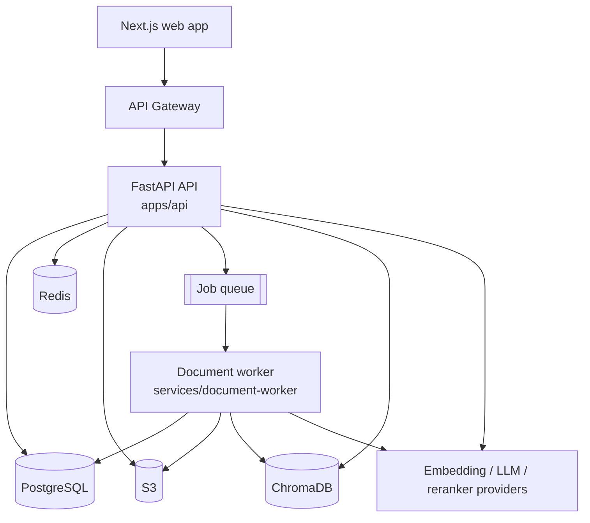

# DocuLens

Production-oriented AI document intelligence platform. Authenticated users upload PDF documents,
organise them into collections, ask natural-language questions and receive grounded answers with
precise, inspectable source citations.

> **Status: repository foundation.** Structure, tool-chain, quality gates, CI and local
> infrastructure exist. Application features (authentication, document processing, RAG, AWS
> deployment) are implemented incrementally following
> [docs/planning/implementation-plan.md](docs/planning/implementation-plan.md).
> [SPECIFICATIONS.md](SPECIFICATIONS.md) is the authoritative product and architecture specification.

## Architecture



The backend follows a hexagonal layering (SPECIFICATIONS.md §72). All business logic lives in
`packages/core` (`doculens`), which has no web-framework, cloud-SDK or persistence dependencies in
its inner layers. `apps/api` and `services/document-worker` are thin interface layers over it.
See [docs/architecture/README.md](docs/architecture/README.md) and
[ADR-001](docs/adr/ADR-001-backend-architecture.md).

## Features (target scope, SPECIFICATIONS.md §2)

- Account registration and secure authentication (JWT access/refresh with rotation).
- PDF upload with validation, asynchronous processing and status tracking.
- Collections, document management, re-processing and re-indexing.
- Hybrid retrieval, optional reranking, deterministic context assembly.
- Grounded, citation-backed answers with prompt-injection defences.
- Conversational follow-ups with query rewriting; persisted conversation history.
- Per-user quotas, rate limiting, AI cost tracking, structured observability.

## Technology stack

| Area       | Choice                                                                          |
| ---------- | ------------------------------------------------------------------------------- |
| Backend    | Python 3.12, FastAPI, Pydantic v2, SQLAlchemy 2, Alembic, LangChain, PyMuPDF    |
| Data       | PostgreSQL, ChromaDB, Amazon S3, Redis                                          |
| Frontend   | Next.js, React, TypeScript (strict), Tailwind CSS, Playwright                   |
| Cloud      | AWS Lambda, API Gateway, RDS, ElastiCache, S3, CloudWatch, IAM, Secrets Manager |
| Delivery   | Terraform, Docker, GitHub Actions with OIDC                                     |
| Tool-chain | uv (Python), pnpm (Node), ruff, mypy, ESLint, Prettier                          |

Libraries are added in the phase that first uses them; every version is pinned
(`uv.lock`, `pnpm-lock.yaml`, Docker tags, Terraform versions, GitHub Actions SHAs).

## RAG pipeline (target)

```text
PDF → validation → text extraction → structure detection → semantic chunking → embeddings
    → vector storage → hybrid retrieval → reranking → context assembly → grounded generation
    → answer + citations
```

## Repository structure

```text
apps/api/                   FastAPI interface layer (package doculens_api)
apps/web/                   Next.js application
packages/core/              Domain, application and infrastructure layers (package doculens)
packages/shared-types/      TypeScript contracts shared with the web app
services/document-worker/   Queue-driven processing worker (package doculens_worker)
infrastructure/terraform/   Staging and production environments
docker/                     Production Dockerfiles and the local compose stack
docs/                       Architecture docs, ADRs, planning notes
.github/workflows/          CI pipeline
```

## Local development

Prerequisites: [uv](https://docs.astral.sh/uv/) ≥ 0.12, Node.js ≥ 24 with pnpm ≥ 11
(`corepack enable`), Docker with Compose, GNU make. Terraform ≥ 1.16 only for infrastructure work.
uv downloads the pinned Python automatically.

```bash
make bootstrap      # uv sync, pnpm install, Playwright browser
cp .env.example .env
make infra-up       # PostgreSQL, Redis, ChromaDB via docker compose
make check          # format, lint, type check, tests, build — same gates as CI
```

Run the API and web app:

```bash
uv run uvicorn doculens_api.main:app --reload --port 8000    # http://localhost:8000/docs
pnpm --filter @doculens/web dev                              # http://localhost:3000
```

Full setup notes, conventions and troubleshooting: [docs/development.md](docs/development.md).

## Environment variables

Documented in [`.env.example`](.env.example) (backend and local services) and
[`apps/web/.env.example`](apps/web/.env.example). Real values live in git-ignored `.env` files
locally and in AWS Secrets Manager in deployed environments (SPECIFICATIONS.md §54).

## Testing

| Layer                                    | Location                                     | Command                       |
| ---------------------------------------- | -------------------------------------------- | ----------------------------- |
| Python unit / API                        | `*/tests/`                                   | `uv run pytest`               |
| Architecture rules                       | `packages/core/tests/unit`                   | part of `uv run pytest`       |
| Web end-to-end                           | `apps/web/e2e`                               | `pnpm build && pnpm test:e2e` |
| Integration, RAG evaluation, adversarial | added with the features they cover (§61–§64) |

## Deployment

Not yet available. The Terraform environment roots and the CI pipeline exist; AWS resources,
the CD workflow and the deployment guide are delivered in the infrastructure phase after the
hosting decisions in [docs/planning/open-questions.md](docs/planning/open-questions.md).

## Security

Baseline controls in place: pinned dependencies, secret scanning, Python and npm dependency
audits, container image scanning, non-root multi-stage images, git-ignored environment files.
Application-level controls (SPECIFICATIONS.md §53) arrive with their features and are documented
in `docs/security.md` when they do.

## API documentation

FastAPI serves OpenAPI at `/docs` and `/openapi.json` on a running API. Only the liveness probe
exists today.

## RAG evaluation

Planned (SPECIFICATIONS.md §62–§63): a curated dataset under `evals/` with retrieval, groundedness
and citation metrics, run separately from the ordinary test suite.

## Engineering decisions

Architecture Decision Records live in [docs/adr/](docs/adr/README.md). Unresolved specification
ambiguities are tracked in [docs/planning/open-questions.md](docs/planning/open-questions.md) and
must be decided explicitly, never silently (SPECIFICATIONS.md §91).
