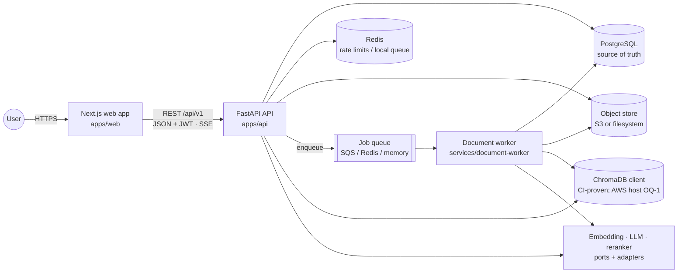
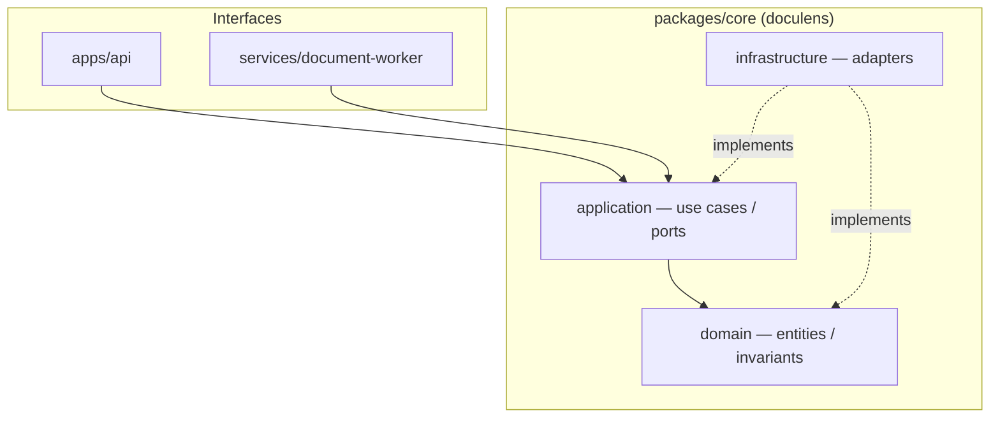
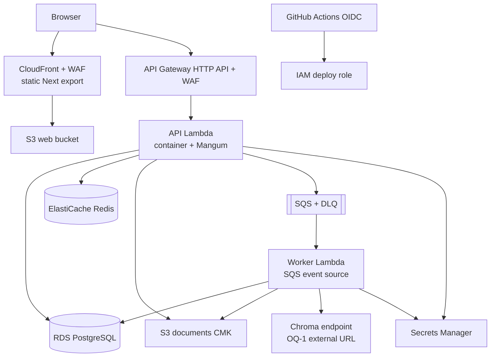

# DocuLens

[](https://github.com/n0ah-n0wa/DocuLens/actions/workflows/ci.yml)

Production-oriented **AI document intelligence** platform: authenticated users upload PDFs,
organise them into collections, ask natural-language questions, and receive **grounded answers
with inspectable source citations**.

This README is written for a senior engineering reviewer evaluating the system as a portfolio /
production-readiness artefact. Capabilities described here are implemented in this repository and
covered by automated tests unless marked otherwise. Open specification ambiguities are tracked
explicitly; they are not silently closed.

> **Honest status.** The **application** (auth, async ingestion, hybrid RAG, citations,
> conversations, quotas, Next.js UI, quality gates, Terraform, and CD **workflows**) is
> implemented and exercised locally and in CI. **Live AWS staging/production has not been
> demonstrated** from this repository — operator bootstrap (OIDC, state, Chroma URL, secrets) is
> still required. Treat “designed to deploy” as distinct from “deployed and green.”
>
> Authority: [`SPECIFICATIONS.md`](SPECIFICATIONS.md) · Compliance matrix:
> [`docs/specification-compliance.md`](docs/specification-compliance.md) · Open questions:
> [`docs/planning/open-questions.md`](docs/planning/open-questions.md)

### Five-minute reviewer path

| Step | Command / artefact                                                          | What it proves                                        |
| ---- | --------------------------------------------------------------------------- | ----------------------------------------------------- |
| 1    | Skim this README + [`docs/README.md`](docs/README.md)                       | Scope, honesty, doc map                               |
| 2    | [`docs/eval/sample-results.md`](docs/eval/sample-results.md) or `make eval` | Deterministic RAG contracts (16/16)                   |
| 3    | `make check`                                                                | Format, lint, types, ≥90% tests, web build, doc links |
| 4    | Critical e2e (infra + API + worker) → `pnpm run test:e2e:critical`          | End-to-end UI vertical slice                          |
| 5    | Optional live API demo → `uv run python scripts/demo_api_happy_path.py`     | Auth → ingest → ask → citations                       |

CD workflows exist (OIDC, staging → production approval) but are **not** claimed green against a live
AWS account from this checkout alone.

### Skills this repository demonstrates

| Skill                    | Where to look first                                                               |
| ------------------------ | --------------------------------------------------------------------------------- |
| Python / FastAPI         | `apps/api`, [`docs/api.md`](docs/api.md), OpenAPI `/docs` locally                 |
| Backend architecture     | Hexagonal `packages/core`, ADR-001, `test_architecture.py`                        |
| PostgreSQL               | Alembic 0001–0005, [`docs/database.md`](docs/database.md), FTS keyword retrieval  |
| Background processing    | `services/document-worker`, SQS/Redis adapters, ADR-006/011                       |
| RAG + LLM ports          | [`docs/rag.md`](docs/rag.md), ADR-016–018, `evals/`                               |
| Vector DB                | Chroma adapter + owner filters (AWS hosting deferred — **OQ-1**)                  |
| Security                 | [`docs/security.md`](docs/security.md), Argon2id, IDOR→404, scans in CI           |
| AWS / Terraform / Docker | `infrastructure/terraform`, `docker/`, [`docs/deployment.md`](docs/deployment.md) |
| CI/CD                    | `.github/workflows/ci.yml`, `cd-staging.yml`, `cd-production.yml`                 |
| Observability            | structlog + EMF + OTEL hooks; ADOT wiring still **OQ-21**                         |
| Testing                  | pytest 90%+, Playwright critical, architecture + adversarial suites               |
| Frontend                 | Next.js TS strict, SSE chat, Vitest + Playwright (`apps/web`)                     |

**Security residuals (scannable):** refresh in `sessionStorage` (**OQ-19**); deployed upload capped
for API Gateway (**OQ-3**); SSE via API Gateway open (**OQ-3b**); no account-deletion / email-verify
APIs (**OQ-24**).

---

## 1. Project overview

DocuLens is a monorepo that implements a full vertical slice of a grounded RAG product:

| Layer           | What exists                                                                                                    |
| --------------- | -------------------------------------------------------------------------------------------------------------- |
| Product surface | Register / login, collections, PDF upload & lifecycle, conversational Q&A with citations                       |
| Core library    | Hexagonal `doculens` package: domain → application → infrastructure adapters                                   |
| Interfaces      | FastAPI HTTP API; queue-driven document worker                                                                 |
| Frontend        | Next.js (TypeScript strict) SPA/SSR-capable app with SSE answer streaming                                      |
| Data plane      | PostgreSQL (source of truth), ChromaDB (vectors), S3/filesystem (originals), Redis (rate limits / local queue) |
| Delivery        | uv + pnpm, Docker images, Terraform (staging/production), GitHub Actions CI + OIDC CD workflows                |
| Quality         | Unit / integration / API / Playwright / architecture import rules / deterministic RAG evals / security scans   |

The system is deliberately **not** a thin LangChain demo: retrieval, prompting, citations, quotas,
and ownership are owned in application code behind ports ([ADR-001](docs/decisions/ADR-001-backend-architecture.md)).

---

## 2. Product pitch

**Problem.** Teams need to ask questions of their own PDF corpora without accepting
ungrounded model answers or leaking tenant data across users.

**Approach.** DocuLens stores originals and structured page/chunk truth in PostgreSQL, indexes
vectors in ChromaDB with owner-scoped filters, retrieves with hybrid search, assembles a bounded
context, and generates answers that must cite retrieved evidence. Invalid citation indexes are
stripped; insufficient evidence yields a refusal rather than invention.

**Audience for this repo.** Engineers assessing architecture, security posture, RAG discipline,
and delivery rigor — not a marketing site claiming a live multi-tenant SaaS.

---

## 3. Key features

Implemented and tested (local/CI):

- **Authentication** — registration, login, refresh rotation with family revocation, logout;
  Argon2id passwords; JWT access + refresh ([ADR-007](docs/decisions/ADR-007-authentication-strategy.md)).
- **Authorization** — every document, collection, and conversation is owner-scoped; cross-tenant
  IDs return **not found** ([ADR-013](docs/decisions/ADR-013-authorization-responses.md)).
- **PDF intake** — multipart upload with extension / MIME / size / signature checks; async pipeline
  to `READY` / `FAILED` with compare-and-set state transitions.
- **Collections & document lifecycle** — CRUD, rename, move, delete saga, reprocess, reindex.
- **Hybrid RAG** — dense retrieval + PostgreSQL full-text + RRF fusion; optional rerank stage
  (default `none`); deterministic context assembly with caps and diversity.
- **Grounded answering** — delimited prompts, citation `[n]` validation, conversational follow-ups
  with query rewriting; SSE stream for progressive tokens (persist only on successful final).
- **Quotas & rate limits** — upload / ask / AI-ops budgets; Redis when deployed, in-memory locally.
- **Observability** — structured logging with correlation IDs, EMF metrics, OpenTelemetry hooks.
- **Frontend** — auth screens, dashboard, documents, collections, chat with citations panel,
  processing-status polling, central API client with one-shot refresh retry.

Explicitly **not** claimed as done: live multi-region SaaS, OCR for scanned PDFs, email verification /
password reset, account deletion, in-app PDF page jump, semantic search API (`OQ-10`), measured p95
SLO harness (§65), or a green production deploy.

---

## 4. Screenshots and behavioural demo

No committed product screenshots exist yet (capture after a local UI run into
`docs/assets/screenshots/`). Until then, prefer **automated behavioural proof**:

```bash
# Compose + migrate + API + worker (QUEUE_BACKEND=redis), then:
pnpm run build && pnpm run test:e2e:critical

# Or API-only vertical slice (same handbook fixture as smoke):
uv run python scripts/demo_api_happy_path.py
```

| Screen           | Suggested capture            | Path                                            |
| ---------------- | ---------------------------- | ----------------------------------------------- |
| Landing / auth   | Brand + sign-in CTA          | `docs/assets/screenshots/01-landing.png`        |
| Document library | Upload + processing badges   | `docs/assets/screenshots/02-documents.png`      |
| Chat + citations | Answer text + citation panel | `docs/assets/screenshots/03-chat-citations.png` |

---

## 5. Architecture diagram


```mermaid
flowchart LR
    User((User)) -->|HTTPS| Web[Next.js web app<br/>apps/web]
    Web -->|REST /api/v1<br/>JSON + JWT · SSE| API[FastAPI API<br/>apps/api]
    API --> PG[(PostgreSQL<br/>source of truth)]
    API --> Redis[(Redis<br/>rate limits / local queue)]
    API --> Store[(Object store<br/>S3 or filesystem)]
    API -->|enqueue| Q[[Job queue<br/>SQS / Redis / memory]]
    Q --> Worker[Document worker<br/>services/document-worker]
    Worker --> PG
    Worker --> Store
    Worker --> Chroma[(ChromaDB client<br/>CI-proven; AWS host OQ-1)]
    API --> Chroma
    API --> AI[Embedding · LLM · reranker<br/>ports + adapters]
    Worker --> AI
```

Chroma is exercised via the **client adapter** in local/CI compose. Terraform does **not**
provision a Chroma server (**OQ-1**); deployed stacks require an operator-supplied `CHROMA_URL`.

**Layering** (enforced by package boundaries + `test_architecture.py`):


```mermaid
flowchart TB
    subgraph Interfaces
        HTTP[apps/api]
        W[services/document-worker]
    end
    subgraph packages_core["packages/core (doculens)"]
        App[application — use cases / ports]
        Dom[domain — entities / invariants]
        Infra[infrastructure — adapters]
    end
    HTTP --> App
    W --> App
    App --> Dom
    Infra -.->|implements| App
    Infra -.->|implements| Dom
```

Deep dive: [`docs/architecture.md`](docs/architecture.md) ·
[ADR-001](docs/decisions/ADR-001-backend-architecture.md).

---

## 6. RAG pipeline

```text
PDF
  → intake validation (API)
  → store original (S3 / filesystem)
  → register document UPLOADED + enqueue (ADR-011)
  → worker: VALIDATING → EXTRACTING → CHUNKING → EMBEDDING → INDEXING → READY
  → ask: retrieve (hybrid) → optional rerank → assemble context → grounded generate
  → validate citations → persist messages + citation rows
  → SSE deltas for display; final event carries the persisted answer
```

| Stage      | Implementation notes                                                                                                                                |
| ---------- | --------------------------------------------------------------------------------------------------------------------------------------------------- |
| Extraction | PyMuPDF, page-aware; OCR is a non-goal (§3)                                                                                                         |
| Chunking   | Configurable size/overlap ([ADR-003](docs/decisions/ADR-003-chunking-strategy.md))                                                                  |
| Embeddings | Port + fake (tests) + OpenAI-compatible ([ADR-004](docs/decisions/ADR-004-embedding-provider.md))                                                   |
| Vectors    | Chroma **client** + tenant filters ([ADR-002](docs/decisions/ADR-002-vector-database.md)); AWS hosting deferred (**OQ-1**)                          |
| Retrieval  | Semantic / keyword / hybrid + selection rules ([ADR-016](docs/decisions/ADR-016-retrieval-service.md))                                              |
| Generation | Grounded prompt builder ([ADR-017](docs/decisions/ADR-017-grounded-prompt.md)); answering ([ADR-018](docs/decisions/ADR-018-answering-pipeline.md)) |
| Safety     | Document/history treated as untrusted; prompt-injection suite + eval categories                                                                     |

Deployed ask latency is constrained by **API Gateway’s ~30s integration limit** until response
streaming closes **OQ-3b**; configuration fails closed on oversized LLM timeouts when `APP_ENV` is
deployed.

---

## 7. Technology stack

| Area           | Choice                                                                                                                        |
| -------------- | ----------------------------------------------------------------------------------------------------------------------------- |
| Language / API | Python 3.12, FastAPI, Pydantic v2, SQLAlchemy 2, Alembic, PyMuPDF                                                             |
| Frontend       | Next.js, React, TypeScript (strict), Tailwind CSS, Vitest, Playwright                                                         |
| Data           | PostgreSQL 17, ChromaDB, Redis, S3 (MinIO locally)                                                                            |
| AI adapters    | OpenAI-compatible HTTP for embeddings/LLM; fake providers for CI; reranker port (default off)                                 |
| Cloud target   | AWS Lambda (container images + RIC), API Gateway HTTP API, RDS, ElastiCache, S3, CloudFront, WAF, Secrets Manager, CloudWatch |
| Delivery       | Terraform ~> 1.16, Docker multi-stage images, GitHub Actions (pinned SHAs), OIDC deploy roles                                 |
| Tooling        | uv, pnpm, ruff, mypy (strict), ESLint, Prettier, Trivy, gitleaks, pip-audit                                                   |

**Not used:** LangChain / LlamaIndex as the orchestration framework (**OQ-25** — intentional;
ports own the boundary). Versions are pinned in `uv.lock`, `pnpm-lock.yaml`, image digests, and
Action SHAs.

---

## 8. Repository structure

```text
apps/api/                     FastAPI interface (package doculens_api)
apps/web/                     Next.js application (@doculens/web)
packages/core/                Domain, application, infrastructure (package doculens)
packages/shared-types/        Shared TypeScript API contracts
services/document-worker/     Queue / CLI / Lambda worker (package doculens_worker)
infrastructure/terraform/     Staging + production roots and modules
docker/                       API/worker Dockerfiles + local compose stack
evals/                        Deterministic RAG evaluation harness
docs/                         Architecture, ADRs, security, deployment, compliance
.github/workflows/            CI, CD staging, CD production
scripts/cd/                   Plan / deploy / smoke / rollback helpers
SPECIFICATIONS.md             Authoritative product + engineering specification
```

---

## 9. Local development

**Prerequisites:** [uv](https://docs.astral.sh/uv/) ≥ 0.12, Node.js 24 + pnpm 11 (`corepack enable`),
Docker Compose v2. GNU make is convenient; on Windows use Git Bash/WSL or the raw commands in
[`docs/development.md`](docs/development.md). Terraform is optional unless you touch IaC.

```bash
git clone <repository-url> doculens && cd doculens
make bootstrap                 # uv sync, pnpm install, Playwright Chromium
cp .env.example .env           # never commit .env
make infra-up                  # postgres, redis, chroma, minio (+ bucket init)
make db-upgrade                # Alembic → DATABASE_URL
make check                     # format, lint, types, tests, web build, doc links
```

Run the product locally:

```bash
uv run uvicorn doculens_api.main:create_app --factory --reload --port 8000
uv run python -m doculens_worker                 # queue consumer (Redis/memory locally)
pnpm --filter @doculens/web dev                  # http://localhost:3000
```

OpenAPI (local only by default): `http://localhost:8000/docs`.

If host port `5432` is taken, set `POSTGRES_PORT` and the port inside `DATABASE_URL` together
(compose maps `${POSTGRES_PORT:-5432}`). Critical e2e env generation respects `POSTGRES_PORT`.

---

## 10. Environment variables

| Surface                      | Template                                         | Notes                                          |
| ---------------------------- | ------------------------------------------------ | ---------------------------------------------- |
| API / worker / local compose | [`.env.example`](.env.example)                   | Full §70 groups; secrets are placeholders only |
| Web                          | [`apps/web/.env.example`](apps/web/.env.example) | `NEXT_PUBLIC_*` only — no secrets              |

Categories in `.env.example` include: application/env, observability (logs + OTel), API/CORS,
JWT/auth rate limits, PostgreSQL, Redis/queue, storage, vector store, embeddings/LLM/reranker,
retrieval/context/prompting, quotas/pricing.

**Deployed environments** refuse unsafe defaults (fake AI providers, console-only logs, plaintext
Redis, oversized uploads vs API Gateway, missing AI keys, etc.). Lambdas receive `APP_SECRETS_ARN`
and hydrate Secrets Manager JSON at cold start — secrets never live in Git.

---

## 11. Testing

| Layer            | Where                                       | How                                                |
| ---------------- | ------------------------------------------- | -------------------------------------------------- |
| Python unit      | `packages/core/tests/unit`, worker/API unit | `uv run pytest -m "not integration"`               |
| API (in-process) | `apps/api/tests/api`                        | same pytest run                                    |
| Integration      | `*/tests/integration`                       | needs compose; `uv run pytest -m integration`      |
| Coverage         | CI gate                                     | ≥ **90%** combined                                 |
| Architecture     | `test_architecture.py`                      | forbids framework imports in domain/application    |
| Web unit         | `apps/web` Vitest                           | `pnpm run test:web`                                |
| E2E smoke        | Playwright `smoke`                          | `pnpm run build && pnpm run test:e2e`              |
| E2E critical     | Playwright `critical`                       | API + worker + infra; `pnpm run test:e2e:critical` |
| Adversarial      | injection, IDOR, corrupt PDF, authz         | unit + API + e2e suites                            |

`make check` mirrors the main application CI jobs. Full CI also runs Terraform, container builds,
and supply-chain scans (see §15).

---

## 12. RAG evaluation

Deterministic harness under [`evals/`](evals/) ([ADR-009](docs/decisions/ADR-009-rag-evaluation-strategy.md),
methodology: [`docs/eval/methodology.md`](docs/eval/methodology.md)):

```bash
uv run python -m evals          # or: make eval
# writes docs/eval/latest.json (git-ignored artefact; CI uploads it)
```

CI runs the suite with **fake** embedding/LLM providers so PRs stay deterministic and cheap.
Categories exercised include answer-present, multi-page / multi-document, unavailable / ambiguous /
contradictory sources, irrelevant corpora, and **prompt-injection** cases. Metrics include
retrieval relevance/precision, context precision/recall, citation correctness, answer relevance,
groundedness, and failure behaviour. Committed snapshot:
[`docs/eval/sample-results.md`](docs/eval/sample-results.md).

**Limitation:** this is not a free-form live-LLM hallucination bake-off. Real-provider scoring is
optional and not a PR gate (**OQ-22**).

---

## 13. Security

Summary of controls (detail: [`docs/security.md`](docs/security.md)):

- Argon2id; JWT refresh rotation + family revoke; owner-scoped repositories.
- Upload validation before persistence; system-owned object keys.
- Prompt/data delimiting; citation index validation; refusal on insufficient evidence.
- Security headers / CSP on web; CORS allow-list (no credentialed wildcards).
- Secrets Manager + OIDC deploy roles; no long-lived AWS keys in GitHub.
- CI: gitleaks, pip-audit, pnpm audit, Trivy (images + Terraform), non-root images.

**Residual / provisional risks (do not ignore):**

| Topic                                     | Status                                             |
| ----------------------------------------- | -------------------------------------------------- |
| Refresh token in `sessionStorage`         | Provisional until httpOnly cookies (**OQ-19**)     |
| API Gateway 10 MiB body vs larger uploads | Cap enforced when deployed (**OQ-3**)              |
| SSE via API Gateway                       | Open (**OQ-3b**); LLM timeout capped when deployed |
| Chroma hosting in AWS                     | Open (**OQ-1**)                                    |
| Account deletion                          | Not implemented (**OQ-24**)                        |

---

## 14. AWS architecture

Target layout ([ADR-008](docs/decisions/ADR-008-aws-deployment-architecture.md)):


```mermaid
flowchart TB
    Browser --> CF[CloudFront + WAF<br/>static Next export]
    Browser --> APIGW[API Gateway HTTP API + WAF]
    APIGW --> APILambda[API Lambda<br/>container + Mangum]
    CF --> S3Web[S3 web bucket]
    APILambda --> RDS[(RDS PostgreSQL)]
    APILambda --> Elasticache[(ElastiCache Redis)]
    APILambda --> S3Docs[S3 documents CMK]
    APILambda --> SQS[[SQS + DLQ]]
    SQS --> WorkerLambda[Worker Lambda<br/>SQS event source]
    WorkerLambda --> RDS
    WorkerLambda --> S3Docs
    WorkerLambda --> ChromaExt[Chroma endpoint<br/>OQ-1 external URL]
    APILambda --> SM[Secrets Manager]
    WorkerLambda --> SM
    GHA[GitHub Actions OIDC] --> DeployRole[IAM deploy role]
```

Terraform modules cover networking, compute, database, cache, queue, storage, IAM, secrets,
observability, API Gateway, frontend, ECR, KMS, and a **vector-store placeholder** (URL/token
wiring only — no Chroma server provisioned). Staging and production are separate roots under
`infrastructure/terraform/envs/`.

**Operator path:** [`docs/deployment.md`](docs/deployment.md).

---

## 15. CI/CD

**CI** ([`.github/workflows/ci.yml`](.github/workflows/ci.yml)) — fail-closed aggregator:

- Backend: ruff format/lint, mypy, unit + integration, coverage ≥90%, package builds, RAG evals,
  doc-link check
- Frontend: Prettier, ESLint, typecheck, Vitest, production build, Playwright smoke
- Critical Playwright job with compose + API + worker
- Terraform fmt / validate / tflint / Trivy config (staging + production matrix)
- Security: gitleaks, pip-audit, pnpm audit
- Containers: build API/worker images and Trivy scan

**CD**

| Workflow                                                   | Gate                                                                     |
| ---------------------------------------------------------- | ------------------------------------------------------------------------ |
| [`cd-staging.yml`](.github/workflows/cd-staging.yml)       | Green CI → build → scan → plan → apply → smoke                           |
| [`cd-production.yml`](.github/workflows/cd-production.yml) | Green CI + green staging for SHA → Environment approval → deploy → smoke |

Authentication to AWS is **OIDC only** ([ADR-022](docs/decisions/ADR-022-github-actions-oidc.md)).
Required GitHub Environment variables include deploy role ARN, state bucket/lock table, a real
`CHROMA_URL`, and (for browsers) `CORS_ALLOW_ORIGINS`. Placeholder Chroma URLs fail the CD tfvars
step.

---

## 16. Deployment

Local never requires AWS. Cloud deploy sequence (when Environments are configured):

1. Bootstrap remote state (`infrastructure/terraform/bootstrap/state`).
2. Configure GitHub Environments (`staging` / `production`) per `docs/deployment.md`.
3. Merge to `main` → CI → staging CD → smoke.
4. Production CD on the same SHA after approval; rollback artefact captures prior Lambda digests.

Smoke (`scripts/cd/smoke_staging.py` / production twin) exercises auth → upload → processing →
ask/citations → cleanup against the live API. Playwright UI smoke covers landing + login.

Images are digest-tagged into ECR; migrate runs as a dedicated Lambda invoke. Frontend is a
static export to S3 with CloudFront invalidation and SPA deep-link rewrites for dynamic routes.

---

## 17. Observability

| Signal      | Mechanism                                                                                   |
| ----------- | ------------------------------------------------------------------------------------------- |
| Logs        | Structured JSON when deployed; console locally; redaction of secrets/document/prompt fields |
| Correlation | `X-Request-ID` (configurable) bound into logging context and error envelope                 |
| Metrics     | CloudWatch Embedded Metric Format on the log stream (HTTP, documents, RAG/AI counters)      |
| Traces      | OpenTelemetry SDK; `none` / `console` locally; `otlp` when deployed (console rejected)      |
| Health      | `/health/live`, `/health/ready` with dependency probes                                      |

ADOT wiring on Lambda and the full §51 metrics catalogue remain **partial** (**OQ-21**). There is
no Prometheus scrape endpoint by design.

---

## 18. Architectural trade-offs

| Decision                        | Trade-off                                     | Why it was accepted                                        |
| ------------------------------- | --------------------------------------------- | ---------------------------------------------------------- |
| Hexagonal core package          | More indirection than a single FastAPI app    | Keeps domain testable without AWS/HTTP; enforces §72       |
| Commit-then-enqueue (ADR-011 A) | Possible orphaned `UPLOADED` on queue blip    | Simpler than outbox; worker reconciles stragglers          |
| Lambda containers (provisional) | 15‑minute / payload limits vs huge PDFs       | Matches spec preference; ECS remains upgrade path          |
| Direct multipart upload         | Hits API Gateway size ceiling when deployed   | Avoids day-one presign complexity; caps fail closed        |
| Fake providers in CI evals      | Weaker signal than live models                | Deterministic, free, blocks regressions on grounding logic |
| `sessionStorage` refresh        | Larger XSS blast radius than httpOnly cookies | Unblocks SPA until **OQ-19** cookie transport              |
| Chroma as vector DB             | Ops burden / OQ-1 hosting gap                 | Spec-selected; adapter isolates a future store swap        |
| No LangChain orchestration      | Reimplement retrieval/prompt plumbing         | Explicit control over citations, refusals, and tests       |

---

## 19. Known limitations

Call these out in any portfolio narrative — they are intentional or tracked, not hidden:

1. **No demonstrated live AWS environment** from CI/CD in this repo’s current operator state.
2. **Chroma in AWS** is not provisioned by Terraform (**OQ-1**).
3. **SSE through API Gateway** unverified for long generations (**OQ-3b**); timeouts capped when deployed.
4. **Upload/download** under API Gateway/Lambda size limits (**OQ-3**); no in-app PDF page viewer.
5. **No email verification, password reset, or account deletion** (**OQ-24**).
6. **No usage dashboard** / incomplete `/users/me` usage payload (§39 partial).
7. **No measured p95 performance suite** against §65 budgets.
8. **Reranker** port exists; production vendor default is `none`.
9. **Accessibility:** labels and structure exist; no axe/WCAG CI gate — AA is not claimed.
10. Open questions remain in [`docs/planning/open-questions.md`](docs/planning/open-questions.md)
    and must be decided with ADRs, not silent code changes (§91).

---

## 20. Future improvements

Prioritised in the spirit of the specification and open questions (not a commitment roadmap):

1. Close **OQ-1** with a concrete Chroma (or alternative) hosting module and network path.
2. Resolve **OQ-3 / OQ-3b** — presigned upload/download and/or API Gateway response streaming /
   Function URL for SSE; restore larger upload budgets safely.
3. **OQ-19** — httpOnly cookie refresh + CSRF strategy; confirm static-export vs server hosting.
4. Prove a **green staging CD** and then production with recorded smoke evidence.
5. Account lifecycle (**OQ-24**), usage UI, semantic search endpoint (**OQ-10**) if still required.
6. Optional real-provider eval schedule (**OQ-22**) and ADOT/X-Ray completeness (**OQ-21**).
7. Performance harness for §65 budgets; broaden a11y automation.
8. Transactional outbox if straggler latency from ADR-011 A becomes material.

---

## Documentation map

| Document                                                               | Purpose                                                   |
| ---------------------------------------------------------------------- | --------------------------------------------------------- |
| [`SPECIFICATIONS.md`](SPECIFICATIONS.md)                               | Requirements source of truth                              |
| [`docs/README.md`](docs/README.md)                                     | Documentation index                                       |
| [`docs/architecture.md`](docs/architecture.md)                         | System design with Implemented / Planned / Pending labels |
| [`docs/api.md`](docs/api.md)                                           | HTTP API inventory and OpenAPI                            |
| [`docs/database.md`](docs/database.md)                                 | PostgreSQL schema and migrations                          |
| [`docs/rag.md`](docs/rag.md)                                           | Ingestion, retrieval, answering pipeline                  |
| [`docs/specification-compliance.md`](docs/specification-compliance.md) | §-by-§ compliance audit                                   |
| [`docs/security.md`](docs/security.md)                                 | Security controls and residual risks                      |
| [`docs/deployment.md`](docs/deployment.md)                             | CD, OIDC, secrets, rollback                               |
| [`docs/operations.md`](docs/operations.md)                             | Ops runbook and troubleshooting                           |
| [`docs/development.md`](docs/development.md)                           | Local setup and conventions                               |
| [`docs/decisions/`](docs/decisions/README.md)                          | Architecture Decision Records                             |
| [`docs/eval/methodology.md`](docs/eval/methodology.md)                 | RAG eval methodology                                      |
| [`docs/planning/open-questions.md`](docs/planning/open-questions.md)   | Specification ambiguities (living)                        |

## License / portfolio note

Treat this repository as an engineering portfolio artefact demonstrating production-shaped
design under an explicit specification. Do not infer commercial availability or a live multi-tenant
deployment from the presence of Terraform and CD workflows alone.
