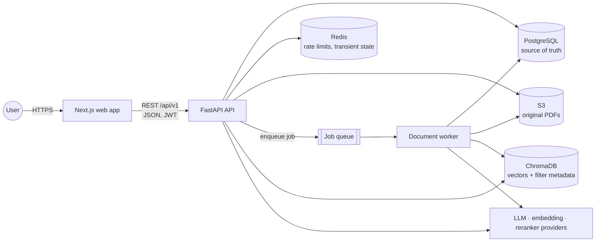
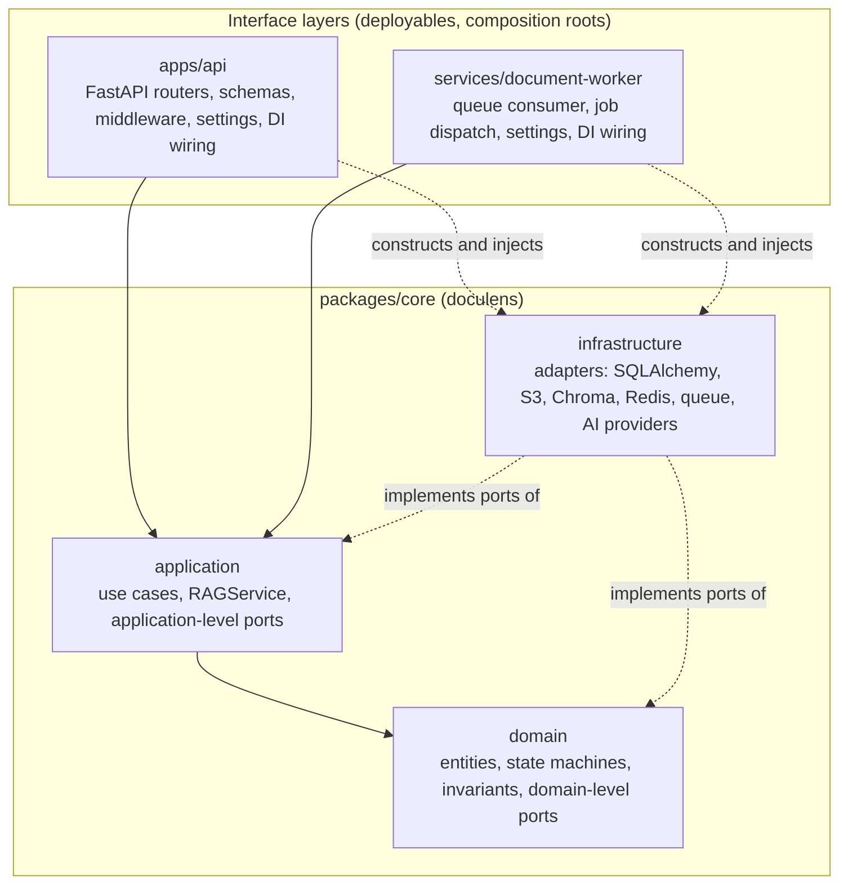
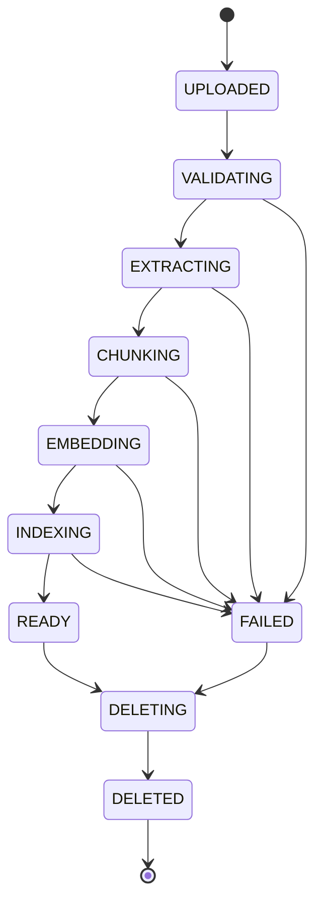
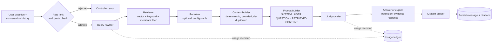
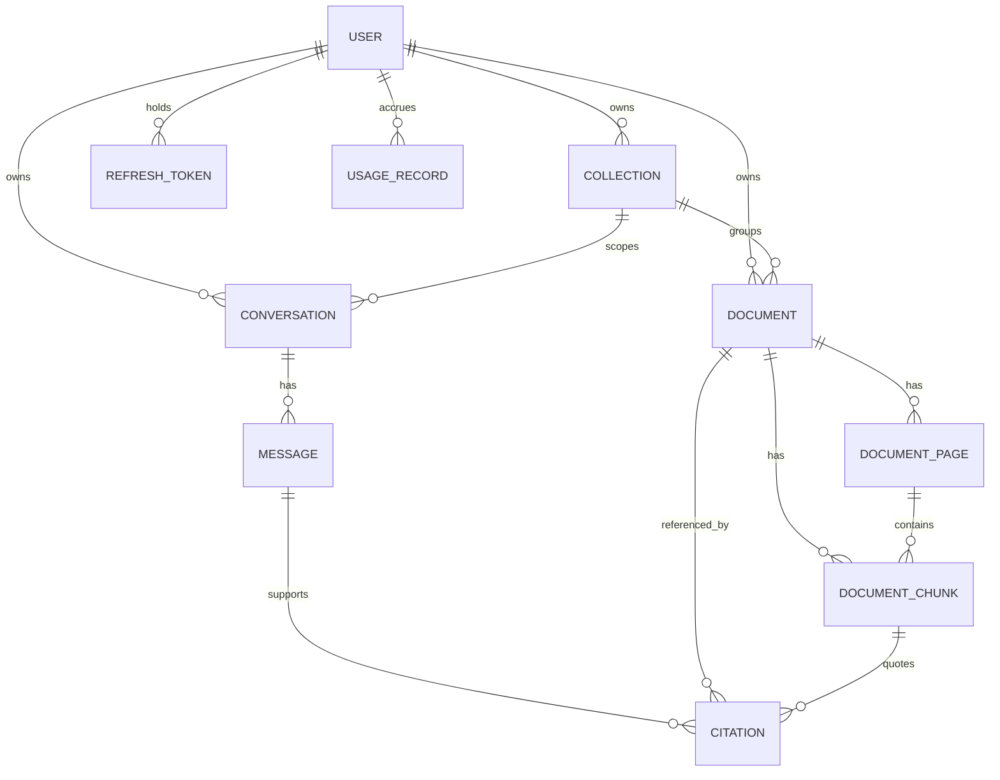
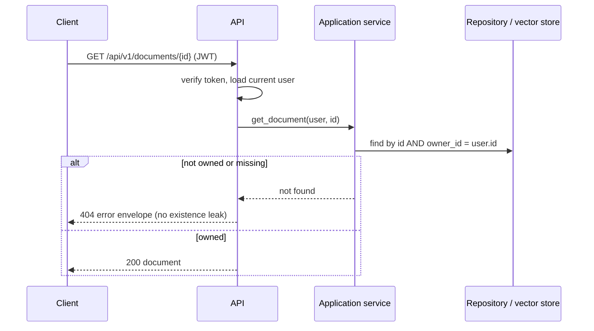
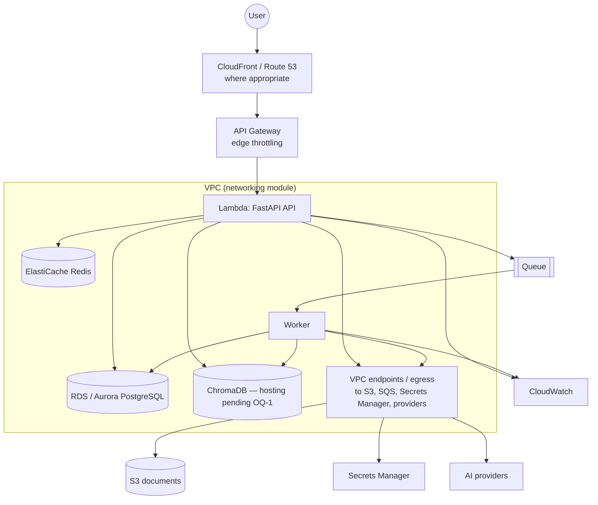
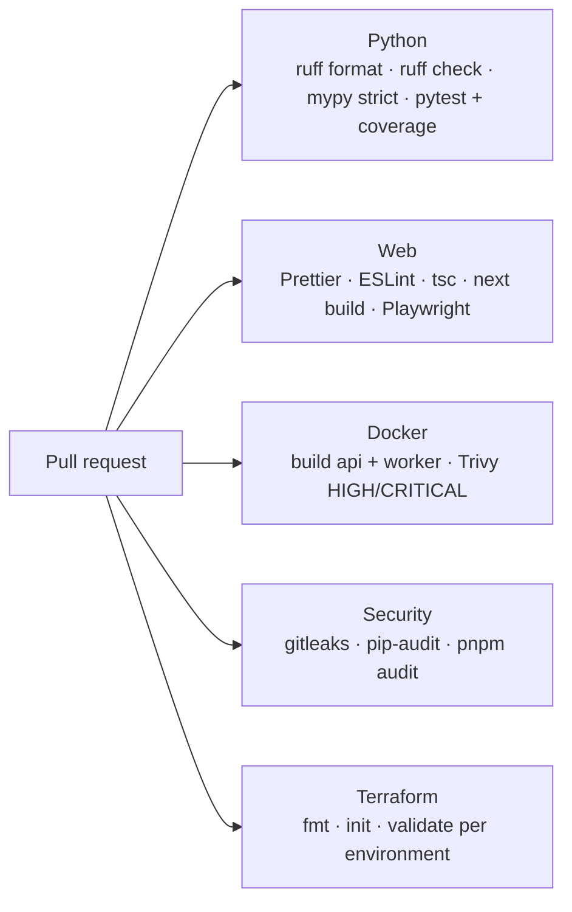
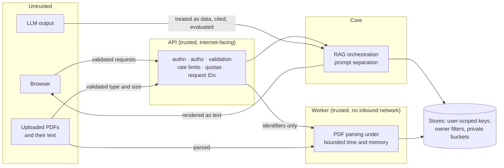

# DocuLens architecture

**Source of truth:** [`SPECIFICATIONS.md`](../SPECIFICATIONS.md). Section references (§) point there.
**Decisions:** [`docs/decisions/`](decisions/README.md). **Unresolved questions:** [`docs/planning/open-questions.md`](planning/open-questions.md) (`OQ-n`).

Every statement in this document carries one of three labels so that the current state of the
system is never confused with its target:

| Label           | Meaning                                                                                                   |
| --------------- | --------------------------------------------------------------------------------------------------------- |
| **Implemented** | Exists in the repository today and is verified by CI.                                                     |
| **Planned**     | Required by the specification, or a direct consequence of it; not yet built.                              |
| **Pending**     | The specification is ambiguous or contradictory; the item must be decided (an `OQ-n`) before it is built. |

Where a _Planned_ item is a consequence rather than a literal requirement, the sentence says so and
names the sections it follows from. Nothing here describes implementation details beyond that.

---

## 1. System context

**Planned** (the web app, API and worker skeletons exist; no data flow is implemented yet).



Principles the specification fixes (§1, §4, §90):

- Every generated answer is grounded in retrievable evidence the user can inspect.
- AI output is an untrusted external dependency: constrained, evaluated, observable and testable.
- Business logic is never coupled to a specific infrastructure provider.
- Long-running document processing never executes inside an API request (§6, §65).

---

## 2. Repository and component map

**Implemented.**

| Component              | Path                       | Package / import name                 | Role                                                                |
| ---------------------- | -------------------------- | ------------------------------------- | ------------------------------------------------------------------- |
| Core                   | `packages/core`            | `doculens-core` / `doculens`          | domain, application and infrastructure layers                       |
| API                    | `apps/api`                 | `doculens-api` / `doculens_api`       | FastAPI: health, auth, users, collections, documents, conversations |
| Worker                 | `services/document-worker` | `doculens-worker` / `doculens_worker` | queue-driven interface layer (entrypoint only)                      |
| Web                    | `apps/web`                 | `@doculens/web`                       | Next.js application (placeholder page)                              |
| Shared contracts       | `packages/shared-types`    | `@doculens/shared-types`              | TypeScript API contracts (error envelope only)                      |
| Infrastructure         | `infrastructure/terraform` | —                                     | staging and production roots (no resources yet)                     |
| Images and local stack | `docker/`                  | —                                     | API and worker images; PostgreSQL, Redis, Chroma                    |

The layout adapts §71 as recorded in [ADR-001](decisions/ADR-001-backend-architecture.md): the
framework-free core is its own package so that packaging itself enforces the §72 boundary.

**Planned** components not yet present: the RAG evaluation harness under `evals/` (§62), the CD
workflow (§60) and the Terraform modules (§57).

---

## 3. Ownership boundaries

**Planned.** Each concern has exactly one owner; the table is the reference when a change could go
in more than one place.

| Concern                                                     | Owner                                              | Follows from |
| ----------------------------------------------------------- | -------------------------------------------------- | ------------ |
| Entities, state machines, invariants, port definitions      | `doculens.domain`                                  | §7, §72      |
| Use cases, RAG orchestration, quota and cost decisions      | `doculens.application`                             | §38–§39, §74 |
| Prompt templates and the SYSTEM / QUESTION / CONTENT split  | `doculens.application` (prompt builder)            | §21–§22      |
| Mapping domain chunks to vector records and filter metadata | `doculens.infrastructure` (vector-store adapter)   | §16          |
| Talking to LLM, embedding and reranker APIs                 | `doculens.infrastructure` (provider adapters)      | §15, §73     |
| HTTP concerns: routes, schemas, error envelope, request IDs | `doculens_api`                                     | §33–§36      |
| Authentication tokens and current-user resolution           | `doculens_api` (transport) + `application` (rules) | §8           |
| Ownership checks on every user-owned resource               | `doculens.application`, never the frontend         | §9           |
| Upload size and type limits                                 | API request handling (before any processing)       | §10          |
| Page-count and content limits                               | worker, during extraction                          | §10.2, §13   |
| Object keys and S3 layout                                   | `doculens.application` (generated identifiers)     | §11          |
| Queue consumption, retries, dead-lettering                  | `doculens_worker` + queue infrastructure           | §48, §66     |
| Configuration loading and start-up validation               | interface layers (composition roots)               | §70          |
| Rendering answers and citations, never as HTML              | `apps/web`                                         | §23–§24, §53 |
| Environment definitions, IAM, secrets                       | `infrastructure/terraform`                         | §54, §57–§58 |

---

## 4. Frontend / backend boundary

**Implemented:** public routes are versioned under `/api/v1` (§33–§34) and platform probes live
under `/health` (`/health/live`, `/health/ready`); versioned routes exist for authentication,
the current user, collections, documents (metadata) and conversations with messages. Every response
carries a request ID (honoured from a well-formed incoming header, otherwise generated) that is
bound to the logging context and returned in the response header (§36). Every failure, whether a
domain error, request validation, an HTTP error or an unhandled exception, answers with the §35
envelope `{ "error": { "code", "message", "request_id", "details?" } }` and never exposes internal
details; the same shape is the shared TypeScript contract. Every response carries baseline
security headers (`X-Content-Type-Options`, `X-Frame-Options`, `Referrer-Policy`, `Cache-Control:
no-store`). The OpenAPI document and interactive docs are served locally and disabled in deployed
environments unless explicitly enabled. Start-up and shutdown run through the application
lifespan, which is where connection pools and clients will be opened and closed.

**Planned** (§9, §33–§36, §40–§44, §53):

- The backend never relies on frontend filtering for authorization; every request is authorized
  server-side against the authenticated user.
- The web app owns: authentication screens and session handling, dashboard, document view, chat
  with citations displayed separately from the answer text, explicit `IDLE / LOADING / SUCCESS /
ERROR / EMPTY` states, responsive layout and WCAG-oriented accessibility.
- The API owns all validation, quota and rate-limit enforcement, and AI orchestration.
- Answer text, quoted citation text and document metadata are untrusted content produced from
  documents or the LLM; the web app renders them as text, never as HTML (§53, XSS).
- The web app must let the user open the source document and navigate to the cited page (§24).
  The transport for that (serving the PDF) is part of `OQ-3`, because the API Gateway and Lambda
  payload limits that constrain uploads constrain downloads equally.

**Pending:**

- `OQ-19` — frontend hosting/rendering mode and where tokens are stored, which determines cookie,
  CORS and CSRF design.
- `OQ-3` — upload and download paths under API Gateway and Lambda payload limits.
- `OQ-3b` — whether answer streaming (Server-Sent Events, §44) can pass through API Gateway.
- `OQ-10` — separate metadata search versus semantic search endpoints.

---

## 5. Backend layering: domain, application, infrastructure, interfaces

**Implemented:** the package structure, its rules and their enforcement; the domain error
hierarchy (stable codes mapped to HTTP statuses by the interface layer); the readiness use case
with its `HealthProbe` port in `application`; validated settings and structured logging in
`infrastructure`; and the two composition roots, which load settings, configure logging and wire
components with no module-level state (the API is started through an application factory).



| Layer            | May depend on                                                       | Must never import                                                                     |
| ---------------- | ------------------------------------------------------------------- | ------------------------------------------------------------------------------------- |
| `domain`         | standard library                                                    | FastAPI, AWS SDK, ChromaDB, LangChain, SQLAlchemy, Redis, application, infrastructure |
| `application`    | `domain`                                                            | the same libraries, plus `infrastructure`                                             |
| `infrastructure` | `domain`, the port definitions in `application`, concrete libraries | use-case internals; other adapters' concrete types                                    |
| interface layers | core, their own framework                                           | —                                                                                     |

Dependency direction is inverted at the ports: inner layers declare `Protocol`s, outer layers
implement them, and only the composition roots (`apps/api`, `services/document-worker`) know which
concrete adapter is bound. This matches §4 (`API → Application → Domain → Infrastructure adapters →
External services`) read as a call chain, with the import direction pointing inward.

Enforcement (implemented): `doculens-core` declares no web framework dependency, and
`packages/core/tests/unit/test_architecture.py` scans `domain` and `application` for forbidden
imports on every CI run. Extending the scan to `infrastructure → application` internals is planned
together with the first adapters.

**Planned** ports (§15, §18, §48, §73–§74): `LLMProvider`, `EmbeddingProvider`, `RerankerProvider`,
a vector-store/retriever abstraction, object storage, a job queue, repositories, rate limiting and
usage tracking. LangChain, when used, stays inside `infrastructure` as an integration layer (§73).
Configuration is loaded and validated once at start-up by the composition root; a deployed
environment with unsafe values fails the process with a clear message (§70, implemented).

---

## 6. Document ingestion

**Implemented** (§10, §12–§16, [ADR-015](decisions/ADR-015-ingestion-pipeline.md),
[ADR-003](decisions/ADR-003-chunking-strategy.md), [ADR-004](decisions/ADR-004-embedding-provider.md),
[ADR-002](decisions/ADR-002-vector-database.md)): the intake use case (extension, MIME,
signature, size and per-user limit checks, duplicate refusal, store then register `UPLOADED`)
and the processor that runs `VALIDATING` (hash, signature, PyMuPDF open, encryption, page
count), `EXTRACTING` (page-level text with empty-page detection and document metadata),
`CHUNKING` (page-scoped, paragraph- and sentence-aware chunks with overlap, verbatim offsets
and stable ids), `EMBEDDING` (batched, retried provider calls with usage accounting) and
`INDEXING` (owner-scoped upsert under chunk-derived vector ids, stale vectors removed) to
`READY`, with compare-and-set state transitions, resumable and idempotent runs, and an
isolated, time- and memory-bounded parser process. The worker's `process <document-id>`
command drives it until the queue consumer exists.

**Planned** (§31–§32): the upload endpoint (`OQ-3`), job enqueue (ADR-011), deletion and the
reprocess/re-index endpoints. The specification fixes the states, validations and storage
layout:



- **Validation** checks extension, MIME type, file signature, size and PDF validity; the filename
  extension alone is never trusted (§10.1). Limits are configuration, never hard-coded (§10.2).
  Size and type limits are enforced at the API before any work is queued; page-count limits are
  enforced by the worker during extraction, because the page count is only known after parsing.
- **Storage** (implemented, [ADR-014](decisions/ADR-014-object-storage.md)): originals live in
  S3 under generated identifiers, `documents/{user_id}/{document_id}/original.pdf`; object keys
  are never derived from user-controlled filenames (§11). The `ObjectStorage` port has an S3
  adapter (AWS or MinIO) and a filesystem adapter for Docker-free development; every object is
  stored with its SHA-256, which is verified on download, and with server-side encryption when
  deployed.
- **Extraction** uses PyMuPDF and preserves page boundaries, page numbers, ordering and metadata;
  pages without extractable text are recorded, never silently dropped (§13). Parsing runs only in
  the worker, under bounded time and memory (§53, excessive resource consumption; §64, malicious PDFs).
- **Chunking** is configurable (`CHUNK_SIZE`, `CHUNK_OVERLAP`, `MIN_CHUNK_SIZE`), prefers semantic
  boundaries, and every chunk keeps document ID, page number, chunk index, text and token count (§14).
- **Embedding and indexing** go through the provider and vector-store abstractions; each vector
  carries `user_id, document_id, collection_id, page_number, chunk_id, chunk_index` (§16). Chunk
  metadata also records the embedding model and chunking configuration used, because §32 requires
  re-indexing when either changes and the system must be able to tell which documents are stale
  (consequence of §14, §32).
- **Vector identity**: a chunk's vector ID is derived deterministically from the chunk so that
  re-indexing upserts instead of duplicating (consequence of §32, §49).
- **Failure** ends in `FAILED` with a safe user-facing message and detailed server-side diagnostics (§12).
- **Deletion** removes PostgreSQL metadata, the S3 object, vectors, pages, chunks and citations where
  appropriate; it is idempotent and partial failures are observable and recoverable (§31). Its
  ordering and guarantees are in §9 of this document.
- **Re-indexing** never creates duplicate vectors (§32).

**Pending:**

- `OQ-3` — upload path (direct multipart versus presigned S3 upload), the download path for
  viewing documents, and therefore whether validation happens before or after S3 persistence.
- `OQ-5` — the distinction between reprocessing and re-indexing.
- `OQ-6` — behaviour on duplicate uploads (content hash scope and response).
- `OQ-7` — hard delete versus tombstone rows, and citation retention.
- `OQ-14` — representation of pages with no extractable text and the outcome for empty PDFs.

---

## 7. RAG architecture

**Implemented** (§15, §73, [ADR-004](decisions/ADR-004-embedding-provider.md)): the
`EmbeddingProvider` port (`embed_documents`, `embed_query`, structured errors, usage accounting),
an OpenAI-compatible adapter with batching, bounded exponential backoff and timeouts, and a
deterministic fake provider for local development and CI; provider selection is configuration.
The `VectorStore` port ([ADR-002](decisions/ADR-002-vector-database.md)) with the ChromaDB
adapter: chunk-derived vector ids, the §16 metadata plus model provenance, one collection per
embedding model, owner-scoped search, delete and re-index enforced inside the adapter, and an
in-memory store for unit tests. Nothing calls either from the pipeline yet.

**Planned** (§16–§27, §37–§39, §44, §74). The pipeline and its guarantees are fixed by the
specification; the diagram includes the controls that wrap it.



- Rate limits and per-user quotas are checked before any AI work starts (§37, §39); every provider
  call records requests, tokens, estimated cost and latency (§38).
- Retrieval always enforces ownership through the `user_id` metadata filter and respects the
  selected scope: one document, a collection or several selected documents (§16, §27).
- The context builder enforces maximum size, maximum chunk count, duplicate removal and source
  diversity, and assembles context deterministically (§20).
- The system prompt mandates grounded answering, citations, explicit "insufficient evidence"
  responses, refusal to invent facts and resistance to instructions found inside documents (§21–§22).
  Retrieved text is data, never instructions; adversarial documents are part of the test suite.
- When evidence is insufficient the response says so explicitly; the system never fabricates and
  never returns AI output as a substitute for a failed provider call (§21, §67).
- Citations are persisted independently of the answer and reference actual retrieved chunks with
  document, page, chunk, quoted text and scores (§7.8, §23).
- Follow-up questions are rewritten into retrieval-aware queries while the user-visible message
  stays unchanged; the original question is stored as the message content (§25–§26).
- With streaming, tokens are forwarded as they arrive and the final assistant message plus
  citations are persisted after the stream completes (§44).
- Every component (rewriter, retriever, reranker, context builder, prompt builder, citation builder)
  is independently testable, and RAG quality is measured by an evaluation harness with a curated
  dataset covering direct, indirect, multi-document and absent answers (§62–§63).

**Pending:**

- `OQ-17` — which LLM, embedding and reranker providers are used (and therefore tokenizer and
  pricing, `OQ-16`, `OQ-11`).
- `OQ-4` — the keyword-retrieval backend for hybrid search.
- `OQ-8` — how a conversation's document scope is modelled.
- `OQ-18` — how partial answers from a failed stream are persisted, and where the rewritten query
  is kept for auditability.
- `OQ-22` — how often the evaluation suite runs and whether it gates CI.
- `OQ-29` — where the insufficient-evidence outcome is decided: by a retrieval-score threshold
  before calling the LLM, by the LLM under instruction, or both.
- `OQ-30` — how citations are attributed to the answer: whether the LLM must reference context
  items explicitly or every context chunk that survived reranking is cited.

---

## 8. Asynchronous processing

**Implemented:** a separate worker deployable with its own image and entrypoint; no queue consumer
or job handlers yet.

**Planned** (§12, §46–§49, §66–§67):

```mermaid
sequenceDiagram
    participant API
    participant PG as PostgreSQL
    participant Q as Job queue
    participant W as Worker
    participant EXT as S3 / Chroma / providers
    API->>PG: commit document row (UPLOADED)
    API->>Q: enqueue {document_id, request_id}
    W->>Q: receive (at-least-once delivery)
    W->>PG: load document; advance state only if the current state matches the expected one
    W->>EXT: extract, embed, index (bounded retries with exponential backoff)
    alt success
        W->>PG: READY, chunk_count, indexed_at
    else retries exhausted
        W->>PG: FAILED + safe message + diagnostics
        W->>Q: dead-letter
    end
```

- Queue and worker are AWS-native (SQS or an equivalent event mechanism) with retry and dead-letter
  handling (§48). Delivery is at-least-once, so every job is idempotent: replays must not corrupt
  state or duplicate vectors (§49, §66).
- Job payloads carry identifiers only, never document content; the worker reads the original from
  S3 (consequence of §11 and §68).
- State transitions are guarded by the expected current state, so a replayed or concurrent job
  cannot move a document backwards (consequence of §49).
- Retries use exponential backoff with bounded attempts (§66); embedding-provider outages leave the
  job retryable rather than failed (§67).
- Dead-lettered jobs are visible in metrics and alarms (§51, failed processing jobs); reprocessing
  is the user-triggered path in §29.
- S3 and Chroma never participate in PostgreSQL transactions; the application uses explicit
  transaction boundaries plus compensation and retry (§46).
- Redis may hold temporary processing state or distributed locks but is never authoritative (§47).
- The originating request ID travels in the job so worker logs and traces correlate with the
  upload request (§36, §52).

**Pending:**

- `OQ-2` — worker compute (Lambda container versus ECS) given Lambda's execution limits and the
  largest allowed documents, and the corresponding container base image.
- `OQ-27` — how the row commit and the enqueue are kept consistent when one of them fails
  ([ADR-011, proposed](decisions/ADR-011-job-enqueue-consistency.md)).

---

## 9. Persistence

**Implemented:** the relational schema for every §7 entity as SQLAlchemy 2 models with
application-generated UUID v4 keys, timezone-aware timestamps, foreign keys with explicit deletion
rules, the §45 indexes, unique and check constraints, and enumerations stored as constrained
varchar columns; the initial Alembic migration (`packages/core/alembic`), which CI verifies against
the models; domain entities as frozen dataclasses with the §7.3 state machine; repository and
unit-of-work ports in `application` implemented by SQLAlchemy adapters in `infrastructure`, where
every read of a user-owned resource requires the owner's ID and no ORM relationships exist (no lazy
loading, no ORM-side cascades); a per-process `Database` (engine,
sessions, readiness probe) created by the composition roots and disposed at shutdown; and
integration tests that run against a real PostgreSQL. Object storage is behind the `ObjectStorage`
port with S3 and filesystem adapters ([ADR-014](decisions/ADR-014-object-storage.md)) and its own
readiness probe. Local PostgreSQL 17, Redis 7.4, ChromaDB 1.5 and MinIO run via docker compose.

**Planned** (§7, §45–§47):



Entities and fields for `USER`, `COLLECTION`, `DOCUMENT`, `DOCUMENT_PAGE`, `DOCUMENT_CHUNK`,
`CONVERSATION`, `MESSAGE` and `CITATION` are exactly those of §7.1–§7.8. Messages are immutable
after creation (§28). Two records are not listed in §7 but follow from other sections, because
Redis may not be authoritative for persistent state (§47):

- `REFRESH_TOKEN` — refresh tokens must be revocable and rotated (§8), which requires a durable
  record of issued tokens (stored hashed, never in clear). Its exact shape is fixed in ADR-007.
- `USAGE_RECORD` — per-user daily quotas and cost limits are enforced server-side (§38–§39), which
  requires a durable ledger of AI usage. Its exact shape is fixed with the quota design.

| Store      | Role                                                                                                                                                                                |
| ---------- | ----------------------------------------------------------------------------------------------------------------------------------------------------------------------------------- |
| PostgreSQL | Source of truth for all relational state; foreign keys; indexes on owner, document, collection, conversation IDs, timestamps and processing status; migrations only through Alembic |
| ChromaDB   | Vectors plus the filter metadata in §16; replaceable behind the retrieval abstraction (§18)                                                                                         |
| S3         | Original PDFs under generated keys (§11); bucket blocks public access and encrypts at rest (§53, §57)                                                                               |
| Redis      | Rate-limit counters, temporary processing state, caches, distributed locks; never authoritative (§47); every key is scoped to a user or a job so no cache can leak across users     |

### Consistency across stores (§31, §46, §69)

PostgreSQL is authoritative; S3 and ChromaDB converge to it. The guarantees the architecture
commits to:

| Operation | Order of writes                                                                           | If interrupted                                                                                    |
| --------- | ----------------------------------------------------------------------------------------- | ------------------------------------------------------------------------------------------------- |
| Ingest    | document row → object in S3 → pages and chunks → vectors → `READY`                        | the document stays in a non-`READY` state; the job is retried or ends `FAILED`; nothing is served |
| Re-index  | new vectors upserted by deterministic ID → chunk rows updated → `indexed_at`              | old vectors remain valid until replaced; no duplicates because IDs are deterministic              |
| Delete    | `DELETING` → vectors removed → S3 object removed → rows removed or tombstoned → `DELETED` | the document stays `DELETING`; deletion is re-runnable and every step is idempotent (§31)         |

A document is served to retrieval only in `READY`; orphaned vectors or objects left by an
interrupted step are unreachable through the application because every read goes through
PostgreSQL first. Recovery of interrupted deletions is a re-run of the same saga; whether that is
triggered by a scheduled sweep or manually is decided with ADR-006.

**Pending:** `OQ-7` (delete semantics), `OQ-8` (conversation scope and nullability of
`collection_id`), `OQ-18` (message status for partial answers),
`OQ-28` (connection management between Lambda and PostgreSQL,
[ADR-012, proposed](decisions/ADR-012-lambda-database-connections.md)).

---

## 10. Authentication

**Implemented** (§8, [ADR-007](decisions/ADR-007-authentication-strategy.md)): registration, login,
refresh and logout under `/api/v1/auth`, and `GET /api/v1/users/me`. Passwords are hashed with
Argon2id in a worker thread and rehashed when parameters change; emails are normalised and
validated; the password policy is length-based and configurable. Access and refresh tokens are
HS256 JWTs carrying `iss`, `aud`, `sub`, `jti`, `iat`, `exp` and `typ`, all required and verified on
every request. Access tokens are short-lived (15 minutes by default) and not stored; refresh tokens
are durable rows grouped into a family per login, rotated on every use through an atomic
compare-and-set, revoked on logout, and a reused (or concurrently presented) token revokes the
whole family. A family has an absolute lifetime fixed at login; rotation never extends it. `SUSPENDED` accounts are refused with 403 everywhere and
`DELETED` accounts behave as unknown credentials. Unknown email and wrong password are
indistinguishable and take the same time. Failures answer 401 with `WWW-Authenticate: Bearer` and
stable codes; credentials and tokens are never logged (§68), while registration, login, failed
login, token reuse and logout are logged as security events carrying identifiers only. Every auth
endpoint is rate limited per client address, and login also per account, answering 429
`RATE_LIMITED` with `Retry-After` (§37); concurrent password hashing is bounded so a login flood
cannot exhaust memory.

**Planned:** the Redis-backed limiter store (§47) replacing the in-process one so limits are
fleet-wide; trusting proxy forwarding headers for the client address once `OQ-19` fixes the edge.

**Pending:** `OQ-19` (token storage in the browser and the resulting CSRF requirements), `OQ-24`
(account deletion, email verification, password reset are not specified).

---

## 11. Authorization

**Implemented** (§9, [ADR-013](decisions/ADR-013-authorization-responses.md)) for collections,
documents, conversations, messages and citations: use cases take the acting user's ID from the
verified bearer token and every repository read of a user-owned resource requires the owner, so a
foreign resource is indistinguishable from a missing one (404 with the same code and message).
Cross-resource references (moving into or creating inside a collection) are verified the same way.
Negative tests cover every route for a second user and for anonymous callers, both in memory and
against PostgreSQL. Vector and object-store scoping (§11, §16) arrive with those adapters.



- Every user-owned resource (collections, documents, conversations, messages, citations) enforces
  `owner_id == authenticated_user.id` server-side; ID enumeration never exposes another user's data.
- Isolation holds in every store: PostgreSQL queries filter by owner, vector queries always include
  the `user_id` filter, S3 keys are prefixed by `user_id`, Redis keys are user-scoped (§11, §16, §47).
- Infrastructure credentials (IAM roles) are per service, not per user; per-user isolation is an
  application responsibility and is therefore tested adversarially (§58, §64).

---

## 12. AWS target architecture

**Implemented:** Terraform roots for `staging` and `production` with pinned Terraform and AWS
provider versions and a partial S3 backend. No resources, roles or modules exist.

**Planned** (§5.4, §57–§58, §87):



- Terraform modules: networking, compute, database, storage, cache, IAM, secrets, observability,
  API Gateway (§57), with `staging` approximating `production`.
- Because RDS and ElastiCache live in private subnets, both Lambda functions run inside the VPC;
  the networking module must therefore provide egress to S3, SQS, Secrets Manager and the external
  AI providers (consequence of §5.4 and §57).
- API Gateway throttling is a coarse first line; the configurable per-endpoint and per-user limits
  of §37 are enforced by the application with Redis.
- IAM follows least privilege with separate roles for API, document processing, deployment and
  monitoring; no unnecessary wildcards (§58).
- Secrets live in AWS Secrets Manager and are read at start-up; nothing is baked into images or
  committed (§54, §56).
- GitHub Actions authenticates to AWS with OIDC, never long-lived keys (§5.5).

Serverless constraints that shape the pending decisions:

| Constraint                                              | Affects                       | Decision         |
| ------------------------------------------------------- | ----------------------------- | ---------------- |
| API Gateway and synchronous Lambda payload limits       | upload and download of PDFs   | `OQ-3`           |
| API Gateway response streaming support                  | SSE for answers (§44)         | `OQ-3b`          |
| Lambda execution time and storage limits                | worker for 500-page documents | `OQ-2`           |
| No managed ChromaDB service                             | vector store hosting          | `OQ-1`           |
| Each Lambda instance opens its own database connections | RDS connection exhaustion     | `OQ-28`, ADR-012 |
| Cold starts inside a VPC versus API p95 < 500 ms (§65)  | API latency budget            | ADR-008          |
| Private database reachable only from the VPC            | running Alembic in deployment | `OQ-23`          |
| Frontend hosting is unspecified                         | CloudFront, cookies, CORS     | `OQ-19`          |

---

## 13. CI/CD

**Implemented** — [`.github/workflows/ci.yml`](../.github/workflows/ci.yml) runs on every pull
request and push to `main`:



Actions are pinned to commit SHAs, Dependabot maintains every ecosystem, and `make check` runs the
same commands locally ([ADR-010](decisions/ADR-010-repository-tooling.md)).

**Planned** (§59–§61, §86): an integration-test job with PostgreSQL, Redis, ChromaDB and
S3-compatible service containers once the first adapters exist; on merge to `main`, build → test →
security scan → deploy staging → smoke tests → manual approval → production; branch protection
requiring green CI and review. Production deployment never depends on a developer machine.

---

## 14. Observability

**Implemented** (§36, §50): both processes emit one JSON object per line with `timestamp`,
`level`, `logger`, `service`, `environment`, `message` and the fields bound to the current
context; the API binds `request_id` for the lifetime of each request and writes one access-log
entry per request with `operation`, `method`, `path`, `status_code` and `duration_ms`. Console
rendering exists for local development only and is rejected in deployed environments.
Standard-library and uvicorn records flow through the same pipeline.

**Planned** (§50–§52):

- Additional bound fields as their features arrive: `user_id`, `document_id`,
  `conversation_id`, `error_code`; sensitive values never logged (§68).
- Metrics for the API (requests, errors, latency, status codes), documents (processing duration,
  failures, pages, chunks), RAG (retrieval, reranking and LLM latency, chunk counts, context size)
  and AI (tokens, models, estimated cost, failed requests).
- OpenTelemetry traces spanning HTTP request → document processing → retrieval → reranking → LLM
  request → persistence; the trace context and request ID cross the queue inside the job message
  so the worker's spans attach to the originating request.
- Dead-letter depth and failed-job counts feed alarms (§51, §66).

**Pending:** `OQ-21` — trace exporter and the metrics mechanism suitable for Lambda.

---

## 15. Security boundaries



Trust boundaries fixed by the specification (§22, §53, §68):

1. **Browser → API**: all input validated; authorization server-side; rate limiting and quotas;
   the API never fetches user-supplied URLs (§53, SSRF).
2. **Documents → worker**: files validated by signature and parser; parsing is isolated in the
   worker, which has no inbound network exposure and its own least-privilege role (§58); extracted
   text is never treated as instructions and is kept separate from system and user prompts.
3. **Providers → application**: AI output is untrusted; failures return controlled errors, never
   fabricated output (§67); provider credentials are only in Secrets Manager.
4. **Application → browser**: answers, quoted text and filenames originate from untrusted content
   and are rendered as text (§53, XSS).
5. **Stores**: every key, query and object path is user-scoped (§11, §16, §47); buckets block
   public access; secrets only via environment and Secrets Manager; `.env` files are git-ignored
   and secret scanning runs in CI.

| Control                                             | Status          |
| --------------------------------------------------- | --------------- |
| Secret scanning, dependency audits, image scanning  | Implemented     |
| Non-root, minimal, pinned container images          | Implemented     |
| Local services bound to loopback only               | Implemented     |
| Generated object keys, hashed and encrypted objects | Implemented     |
| Input validation, upload validation                 | Planned         |
| Authentication, authorization, ownership checks     | Implemented     |
| Prompt-injection separation and adversarial tests   | Planned         |
| Rate limiting of authentication endpoints           | Implemented     |
| Rate limiting elsewhere, quotas, AI cost controls   | Planned         |
| Bounded PDF parsing in an isolated worker           | Planned         |
| Text-only rendering of AI and document content      | Planned         |
| Least-privilege IAM, Secrets Manager                | Planned         |
| CSRF strategy, token storage                        | Pending `OQ-19` |

---

## 16. Status summary

| Area                      | Implemented                                                                                                                                                                | Planned                                                                       | Pending decisions                             |
| ------------------------- | -------------------------------------------------------------------------------------------------------------------------------------------------------------------------- | ----------------------------------------------------------------------------- | --------------------------------------------- |
| Layering and packages     | structure, enforcement test, images, error hierarchy, readiness port, settings, logging, composition roots                                                                 | ports, adapters                                                               | —                                             |
| Frontend/backend boundary | `/api/v1` convention, request IDs, error envelope, health probes, OpenAPI                                                                                                  | text rendering, versioned routes                                              | OQ-3, OQ-3b, OQ-10, OQ-19                     |
| Ingestion                 | intake validation, isolated PyMuPDF extraction, page persistence, semantic chunking, embedding and ChromaDB indexing to READY (ADR-002/003/004/015), CAS state transitions | upload endpoint, deletion, reprocess and re-index endpoints, staleness checks | OQ-3, OQ-5, OQ-7                              |
| RAG                       | embedding provider port and adapters (ADR-004), vector store port and ChromaDB adapter with tenant isolation (ADR-002)                                                     | indexing stage, retrieval, §17–§27 components, quotas, usage ledger           | OQ-4, OQ-8, OQ-17, OQ-18, OQ-22, OQ-29, OQ-30 |
| Async processing          | worker deployable                                                                                                                                                          | queue, guarded transitions, retries, DLQ                                      | OQ-2, OQ-27 (ADR-011)                         |
| Persistence               | §7 schema, Alembic migration, repositories, unit of work, DB probe, object storage port with S3 and filesystem adapters (ADR-014)                                          | usage ledger, consistency model                                               | OQ-7, OQ-8, OQ-18, OQ-28 (ADR-012)            |
| Authentication            | §8 registration, login, atomic refresh rotation, logout, Argon2id, JWT claims, auth rate limiting, audit events                                                            | Redis limiter store                                                           | OQ-12, OQ-19, OQ-24                           |
| Authorization             | §9 ownership on collections, documents, conversations, messages, citations                                                                                                 | vector and object-store scoping                                               | —                                             |
| AWS                       | Terraform roots                                                                                                                                                            | §57 modules, VPC egress, OIDC                                                 | OQ-1, OQ-2, OQ-3, OQ-3b, OQ-19, OQ-23, OQ-28  |
| CI/CD                     | CI pipeline                                                                                                                                                                | integration job, CD pipeline                                                  | —                                             |
| Observability             | structured JSON logs, request correlation, access log                                                                                                                      | metrics, tracing, queue correlation, DLQ alarms                               | OQ-21                                         |
