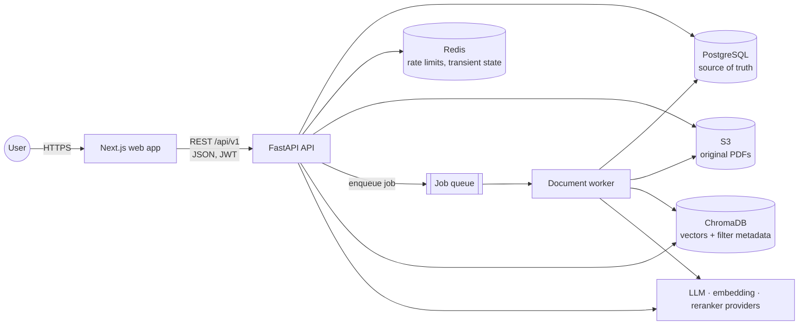
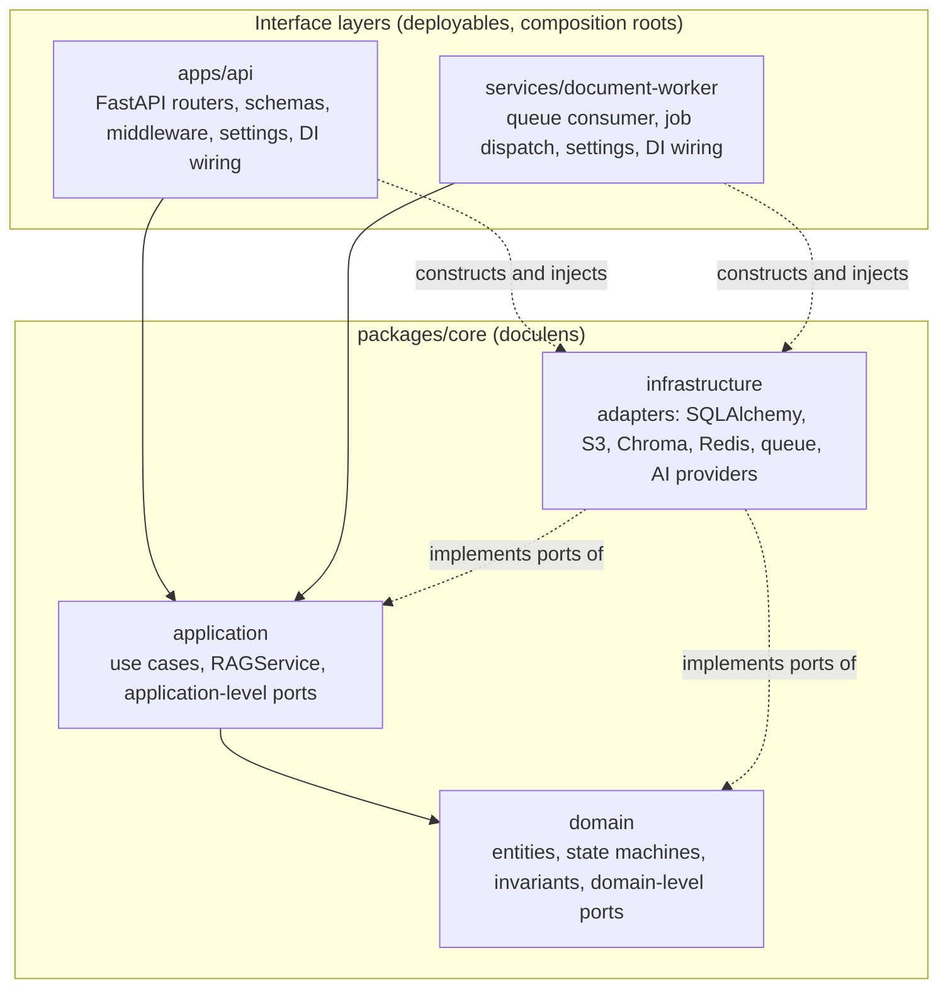
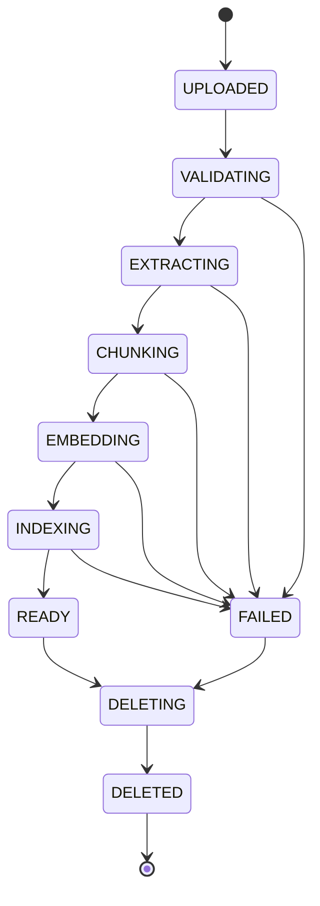
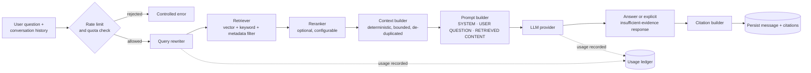
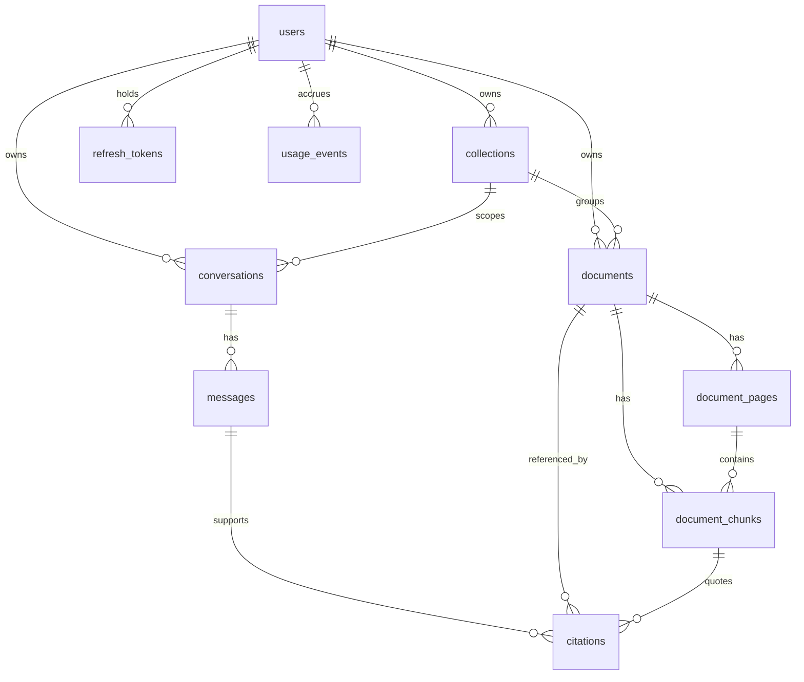
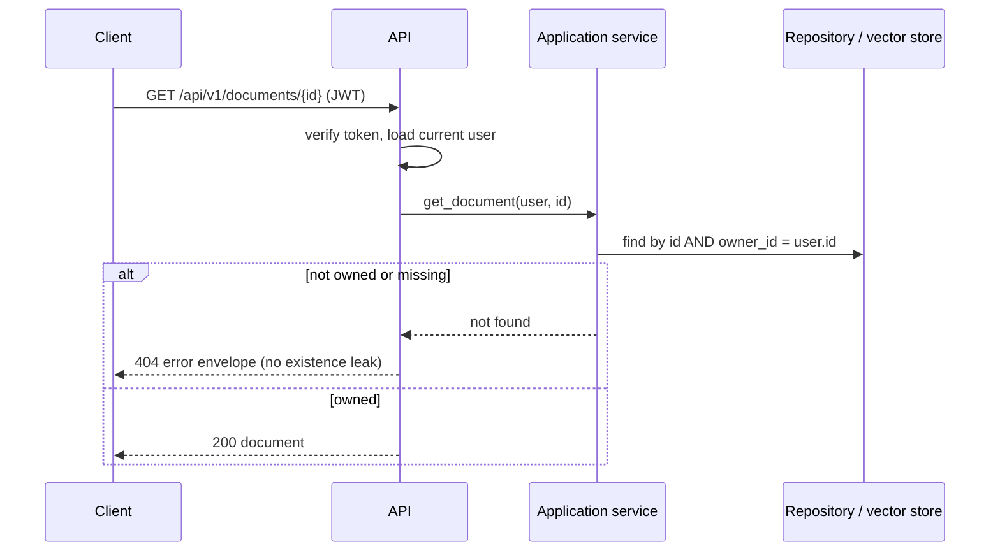
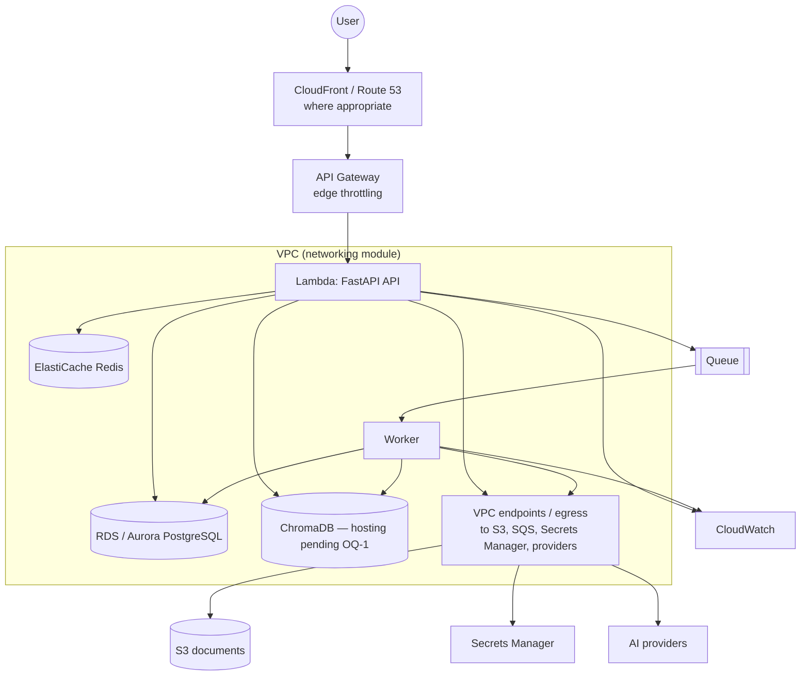
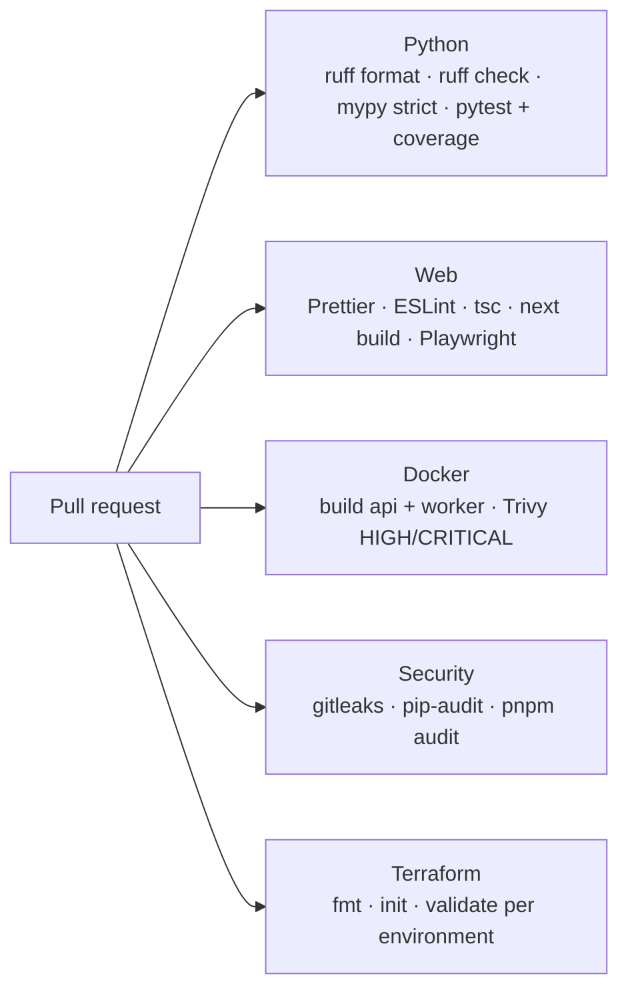
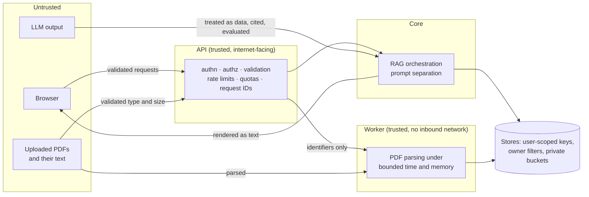

# DocuLens architecture

**Source of truth:** [`SPECIFICATIONS.md`](../SPECIFICATIONS.md). Section references (§) point there.
**Decisions:** [`docs/decisions/`](decisions/README.md). **Unresolved questions:** [`docs/planning/open-questions.md`](planning/open-questions.md) (`OQ-n`).

Every statement in this document carries one of three labels so that the current state of the
system is never confused with its target:

| Label           | Meaning                                                                                                   |
| --------------- | --------------------------------------------------------------------------------------------------------- |
| **Implemented** | Exists in the repository today and is verified by CI.                                                     |
| **Planned**     | Required by the specification, or a direct consequence of it; not yet built.                              |
| **Pending**     | The specification is ambiguous or contradictory; the item must be decided (an `OQ-n`) before it is built. |

Where a _Planned_ item is a consequence rather than a literal requirement, the sentence says so and
names the sections it follows from. Nothing here describes implementation details beyond that.

---

## 1. System context

**Implemented** locally and in CI: authenticated upload → async processing → hybrid RAG with
citations, conversations, quotas, and the Next.js UI. **Not live:** AWS staging/production
deploy (operator setup still required; Chroma hosting **OQ-1**). See
[`specification-compliance.md`](specification-compliance.md).

```mermaid
flowchart LR
    User((User)) -->|HTTPS| Web[Next.js web app]
    Web -->|REST /api/v1<br/>JSON, JWT| API[FastAPI API]
    API --> PG[(PostgreSQL<br/>source of truth)]
    API --> Redis[(Redis<br/>rate limits, transient state)]
    API --> S3[(S3<br/>original PDFs)]
    API -->|enqueue job| Q[[Job queue]]
    Q --> W[Document worker]
    W --> PG
    W --> S3
    W --> VS[(ChromaDB<br/>vectors + filter metadata)]
    API --> VS
    API --> AI[LLM · embedding · reranker providers]
    W --> AI
```

Principles the specification fixes (§1, §4, §90):

- Every generated answer is grounded in retrievable evidence the user can inspect.
- AI output is an untrusted external dependency: constrained, evaluated, observable and testable.
- Business logic is never coupled to a specific infrastructure provider.
- Long-running document processing never executes inside an API request (§6, §65).

---

## 2. Repository and component map

**Implemented.**

| Component              | Path                       | Package / import name                 | Role                                                                   |
| ---------------------- | -------------------------- | ------------------------------------- | ---------------------------------------------------------------------- |
| Core                   | `packages/core`            | `doculens-core` / `doculens`          | domain, application and infrastructure layers                          |
| API                    | `apps/api`                 | `doculens-api` / `doculens_api`       | FastAPI: health, auth, users, collections, documents, conversations    |
| Worker                 | `services/document-worker` | `doculens-worker` / `doculens_worker` | queue-driven document pipeline (Lambda/RIC + local entrypoints)        |
| Web                    | `apps/web`                 | `@doculens/web`                       | Next.js app: auth, documents/collections, grounded chat with citations |
| Shared contracts       | `packages/shared-types`    | `@doculens/shared-types`              | TypeScript API contracts (errors, auth, documents, collections)        |
| Infrastructure         | `infrastructure/terraform` | —                                     | staging/production roots + modules (code complete; live apply pending) |
| Images and local stack | `docker/`                  | —                                     | API and worker images; PostgreSQL, Redis, Chroma                       |

The layout adapts §71 as recorded in [ADR-001](decisions/ADR-001-backend-architecture.md): the
framework-free core is its own package so that packaging itself enforces the §72 boundary.

**Open hosting items:** Chroma in AWS (**OQ-1**), Lambda limits vs large PDFs (**OQ-2**), SSE via
API Gateway (**OQ-3b**). CD **workflows** exist ([`deployment.md`](deployment.md)); a green live
staging deploy still needs GitHub Environment variables and AWS bootstrap.
Terraform modules (§57) live under `infrastructure/terraform/`. The RAG evaluation harness lives
under `evals/` (§62–§63) and runs deterministically in CI via `make eval` / `uv run python -m evals`,
writing machine-readable results to `docs/eval/latest.json`. Methodology and limitations:
[`docs/eval/methodology.md`](eval/methodology.md). Compliance matrix:
[`specification-compliance.md`](specification-compliance.md).

---

## 3. Ownership boundaries

**Implemented** (enforced by package layout and `test_architecture.py`). Each concern has exactly
one owner; the table is the reference when a change could go in more than one place.

| Concern                                                     | Owner                                              | Follows from |
| ----------------------------------------------------------- | -------------------------------------------------- | ------------ |
| Entities, state machines, invariants, port definitions      | `doculens.domain`                                  | §7, §72      |
| Use cases, RAG orchestration, quota and cost decisions      | `doculens.application`                             | §38–§39, §74 |
| Prompt templates and the SYSTEM / QUESTION / CONTENT split  | `doculens.application` (prompt builder)            | §21–§22      |
| Mapping domain chunks to vector records and filter metadata | `doculens.infrastructure` (vector-store adapter)   | §16          |
| Talking to LLM, embedding and reranker APIs                 | `doculens.infrastructure` (provider adapters)      | §15, §73     |
| HTTP concerns: routes, schemas, error envelope, request IDs | `doculens_api`                                     | §33–§36      |
| Authentication tokens and current-user resolution           | `doculens_api` (transport) + `application` (rules) | §8           |
| Ownership checks on every user-owned resource               | `doculens.application`, never the frontend         | §9           |
| Upload size and type limits                                 | API request handling (before any processing)       | §10          |
| Page-count and content limits                               | worker, during extraction                          | §10.2, §13   |
| Object keys and S3 layout                                   | `doculens.application` (generated identifiers)     | §11          |
| Queue consumption, retries, dead-lettering                  | `doculens_worker` + queue infrastructure           | §48, §66     |
| Configuration loading and start-up validation               | interface layers (composition roots)               | §70          |
| Rendering answers and citations, never as HTML              | `apps/web`                                         | §23–§24, §53 |
| Environment definitions, IAM, secrets                       | `infrastructure/terraform`                         | §54, §57–§58 |

---

## 4. Frontend / backend boundary

**Implemented:** public routes are versioned under `/api/v1` (§33–§34) and platform probes live
under `/health` (`/health/live`, `/health/ready`); versioned routes exist for authentication,
the current user, collections, documents (metadata) and conversations with messages. Every response
carries a request ID (honoured from a well-formed incoming header, otherwise generated) that is
bound to the logging context and returned in the response header (§36). Every failure, whether a
domain error, request validation, an HTTP error or an unhandled exception, answers with the §35
envelope `{ "error": { "code", "message", "request_id", "details?" } }` and never exposes internal
details; the same shape is the shared TypeScript contract. Every response carries baseline
security headers (`X-Content-Type-Options`, `X-Frame-Options`, `Referrer-Policy`, `Cache-Control:
no-store`). The OpenAPI document and interactive docs are served locally and disabled in deployed
environments unless explicitly enabled. Start-up and shutdown run through the application
lifespan, which is where connection pools and clients will be opened and closed.

**Implemented (shell + documents + chat):** login and registration screens; authenticated layout;
dashboard; document list/search/upload/detail with processing-status polling; collection
CRUD; conversation list/create/delete, message history, question composer with SSE streaming
(`POST .../messages/stream`), progressive token display, cancel/retry, and a first-class
citations panel that only appears after the stream's final persisted answer; citation filenames and
document links are resolved only from the documents API (never invented on the client); a
central API client with multipart upload support, §35 error parsing and one-shot refresh retry;
Vitest coverage for client/session/validation/citation/SSE helpers (ADR-021). Server-side
authorization, quotas and rate limits, validation, and AI orchestration live in the API/core —
never in the frontend. Answer text, citation quotes and filenames are rendered as text, never HTML.

**Not implemented / pending:**

- Cited-page PDF open/navigate in the UI (§24) — needs download/view transport (`OQ-3`).
- `OQ-19` — production cookie refresh / CSRF; provisional in-memory access + `sessionStorage`
  refresh (ADR-021).
- `OQ-3b` — whether SSE can pass through API Gateway when deployed.
- `OQ-10` — semantic `POST /search` (filename `?q=` exists).

---

## 5. Backend layering: domain, application, infrastructure, interfaces

**Implemented:** the package structure, its rules and their enforcement; the domain error
hierarchy (stable codes mapped to HTTP statuses by the interface layer); the readiness use case
with its `HealthProbe` port in `application`; validated settings and structured logging in
`infrastructure`; and the two composition roots, which load settings, configure logging and wire
components with no module-level state (the API is started through an application factory).

```mermaid
flowchart TB
    subgraph Interfaces["Interface layers (deployables, composition roots)"]
        HTTP["apps/api<br/>FastAPI routers, schemas, middleware, settings, DI wiring"]
        Worker["services/document-worker<br/>queue consumer, job dispatch, settings, DI wiring"]
    end
    subgraph Core["packages/core (doculens)"]
        App["application<br/>use cases, RAGService, application-level ports"]
        Dom["domain<br/>entities, state machines, invariants, domain-level ports"]
        Infra["infrastructure<br/>adapters: SQLAlchemy, S3, Chroma, Redis, queue, AI providers"]
    end
    HTTP --> App
    Worker --> App
    App --> Dom
    Infra -. implements ports of .-> Dom
    Infra -. implements ports of .-> App
    HTTP -. constructs and injects .-> Infra
    Worker -. constructs and injects .-> Infra
```

| Layer            | May depend on                                                       | Must never import                                                                     |
| ---------------- | ------------------------------------------------------------------- | ------------------------------------------------------------------------------------- |
| `domain`         | standard library                                                    | FastAPI, AWS SDK, ChromaDB, LangChain, SQLAlchemy, Redis, application, infrastructure |
| `application`    | `domain`                                                            | the same libraries, plus `infrastructure`                                             |
| `infrastructure` | `domain`, the port definitions in `application`, concrete libraries | use-case internals; other adapters' concrete types                                    |
| interface layers | core, their own framework                                           | —                                                                                     |

Dependency direction is inverted at the ports: inner layers declare `Protocol`s, outer layers
implement them, and only the composition roots (`apps/api`, `services/document-worker`) know which
concrete adapter is bound. This matches §4 (`API → Application → Domain → Infrastructure adapters →
External services`) read as a call chain, with the import direction pointing inward.

### Adding an adapter (reviewer sketch)

1. Declare or reuse a `Protocol` in `doculens.application` (or domain for domain-owned ports).
2. Implement a **fake** in `doculens.testing` / infrastructure for unit tests.
3. Implement the real adapter under `doculens.infrastructure` (HTTP, SQL, AWS SDK, …).
4. Wire the choice in the composition root from validated settings (`EMBEDDING_PROVIDER`, …).
5. Extend unit tests + an integration test if the adapter talks to a real dependency.
6. Never import FastAPI/boto3/Chroma from `domain` or `application` — `test_architecture.py` fails CI.

Enforcement (implemented): `doculens-core` declares no web framework dependency, and
`packages/core/tests/unit/test_architecture.py` scans `domain` and `application` for forbidden
imports on every CI run.

**Implemented** ports and adapters: `LLMProvider`, `EmbeddingProvider`, `RerankerProvider`
(`none`/`fake` only), vector store / retrievers, object storage, job queue, repositories, unit of
work, rate limiting and usage tracking. LangChain, when used, stays inside `infrastructure` (§73).
Configuration is loaded and validated once at start-up by the composition root; a deployed
environment with unsafe values fails the process with a clear message (§70).

---

## 6. Document ingestion

**Implemented** (§10, §12–§16, [ADR-015](decisions/ADR-015-ingestion-pipeline.md),
[ADR-003](decisions/ADR-003-chunking-strategy.md), [ADR-004](decisions/ADR-004-embedding-provider.md),
[ADR-002](decisions/ADR-002-vector-database.md)): the intake use case (extension, MIME,
signature, size and per-user limit checks, duplicate refusal, store then register `UPLOADED`)
and the processor that runs `VALIDATING` (hash, signature, PyMuPDF open, encryption, page
count), `EXTRACTING` (page-level text with empty-page detection and document metadata),
`CHUNKING` (page-scoped, paragraph- and sentence-aware chunks with overlap, verbatim offsets
and stable ids), `EMBEDDING` (batched, retried provider calls with usage accounting) and
`INDEXING` (owner-scoped upsert under chunk-derived vector ids, stale vectors removed) to
`READY`, with compare-and-set state transitions, resumable and idempotent runs, and an
isolated, time- and memory-bounded parser process. The worker consumes the configured queue
(`memory` / Redis / SQS) and also exposes `process <document-id>` for a single document.

**Implemented** (§29, §31, §32, [ADR-019](decisions/ADR-019-document-lifecycle.md),
[ADR-020](decisions/ADR-020-document-upload-transport.md)): upload (`POST /documents`, direct
multipart, provisional OQ-3), filename search (`GET /documents?q=`), inspect (including
extraction metadata), rename, move, delete (idempotent tombstone saga: vectors → object store →
pages/chunks → `DELETED`), reprocess (`VALIDATING`) and re-index (`CHUNKING`). Tombstones are
hidden from reads; citations keep `document_id` and lose `chunk_id`. Job enqueue after intake
follows ADR-011.

**Planned** (§31–§32): presigned upload for large Lambda payloads (OQ-3 upgrade) and document
download/view. The specification fixes the states, validations and storage layout:

```mermaid
stateDiagram-v2
    [*] --> UPLOADED
    UPLOADED --> VALIDATING
    VALIDATING --> EXTRACTING
    EXTRACTING --> CHUNKING
    CHUNKING --> EMBEDDING
    EMBEDDING --> INDEXING
    INDEXING --> READY
    VALIDATING --> FAILED
    EXTRACTING --> FAILED
    CHUNKING --> FAILED
    EMBEDDING --> FAILED
    INDEXING --> FAILED
    READY --> DELETING
    FAILED --> DELETING
    DELETING --> DELETED
    DELETED --> [*]
```

- **Validation** checks extension, MIME type, file signature, size and PDF validity; the filename
  extension alone is never trusted (§10.1). Limits are configuration, never hard-coded (§10.2).
  Size and type limits are enforced at the API before any work is queued; page-count limits are
  enforced by the worker during extraction, because the page count is only known after parsing.
- **Storage** (implemented, [ADR-014](decisions/ADR-014-object-storage.md)): originals live in
  S3 under generated identifiers, `documents/{user_id}/{document_id}/original.pdf`; object keys
  are never derived from user-controlled filenames (§11). The `ObjectStorage` port has an S3
  adapter (AWS or MinIO) and a filesystem adapter for Docker-free development; every object is
  stored with its SHA-256, which is verified on download, and with server-side encryption when
  deployed.
- **Extraction** uses PyMuPDF and preserves page boundaries, page numbers, ordering and metadata;
  pages without extractable text are recorded, never silently dropped (§13). Parsing runs only in
  the worker, under bounded time and memory (§53, excessive resource consumption; §64, malicious PDFs).
- **Chunking** is configurable (`CHUNK_SIZE`, `CHUNK_OVERLAP`, `MIN_CHUNK_SIZE`), prefers semantic
  boundaries, and every chunk keeps document ID, page number, chunk index, text and token count (§14).
- **Embedding and indexing** go through the provider and vector-store abstractions; each vector
  carries `user_id, document_id, collection_id, page_number, chunk_id, chunk_index` (§16). Chunk
  metadata also records the embedding model and chunking configuration used, because §32 requires
  re-indexing when either changes and the system must be able to tell which documents are stale
  (consequence of §14, §32).
- **Vector identity**: a chunk's vector ID is derived deterministically from the chunk so that
  re-indexing upserts instead of duplicating (consequence of §32, §49).
- **Failure** ends in `FAILED` with a safe user-facing message and detailed server-side diagnostics (§12).
- **Deletion** removes PostgreSQL metadata, the S3 object, vectors, pages, chunks and citations where
  appropriate; it is idempotent and partial failures are observable and recoverable (§31). Its
  ordering and guarantees are in §9 of this document.
- **Re-indexing** never creates duplicate vectors (§32).

**Pending / provisional:**

- `OQ-3` — download/view path; presigned upload remains the upgrade for large Lambda payloads
  (direct multipart is provisional under ADR-020 with a deployed size cap).
- `OQ-6` / `OQ-14` — provisionally decided in ADR-015 (duplicate 409; empty-text pages stored).

---

## 7. RAG architecture

**Implemented** (§21, §23, §25, §26, §28, [ADR-018](decisions/ADR-018-answering-pipeline.md)):
the answering use case behind `RagService.answer`: follow-up rewriting (fail-open), retrieval,
reranking, context assembly, the grounded prompt, generation, server-side validation of `[n]`
references into citation rows, and persistence of the user and assistant messages with their
citations in one transaction. An empty context answers with the insufficient-evidence sentence
without calling the model; a generation failure persists nothing.

**Implemented** (§9, §28, §33): the conversation routes: create, list (most recently updated
first), inspect, rename or move, delete (messages and citations go with it), list messages with
their citations, and `POST /api/v1/conversations/{id}/messages`, which asks a question in the
conversation (optionally scoped to selected documents) and returns both persisted turns with the
citations, the retrieval, usage and timing metadata. Every route addresses the caller's own
conversations only; unknown and foreign ids are indistinguishable. Timestamps come from a
strictly increasing UTC clock so turns and listings keep their order under a coarse system clock.

**Implemented** (§21, §22, [ADR-017](decisions/ADR-017-grounded-prompt.md)): the grounded
prompt builder: a fixed, versioned system policy (evidence only, no unsupported claims, the exact
insufficient-evidence sentence, `[index]` citations, document text is data), earlier turns as
their own bounded messages, and one final user message with the escaped, numbered document
blocks first and the question last.

**Implemented** (§21, §73, [ADR-005](decisions/ADR-005-llm-provider.md)): the `LLMProvider`
port (`generate` over ordered chat messages, structured errors, usage with input and output
tokens), an OpenAI-compatible chat-completions adapter with timeouts and bounded retries, and a
deterministic fake used by local/CI; the answering use case calls it for sync and SSE asks.

**Implemented** (§15, §73, [ADR-004](decisions/ADR-004-embedding-provider.md)): the
`EmbeddingProvider` port (`embed_documents`, `embed_query`, structured errors, usage accounting),
an OpenAI-compatible adapter with batching, bounded exponential backoff and timeouts, and a
deterministic fake provider for local development and CI; provider selection is configuration.
The `VectorStore` port ([ADR-002](decisions/ADR-002-vector-database.md)) with the ChromaDB
adapter: chunk-derived vector ids, the §16 metadata plus model provenance, one collection per
embedding model, owner-scoped search, delete and re-index enforced inside the adapter, and an
in-memory store for unit tests. The indexing stages of the ingestion pipeline write through both.

**Implemented** (§17, §18, §20, §27, [ADR-016](decisions/ADR-016-retrieval-service.md)): the
retrieval service behind the `RagService` boundary, one component per §17 stage: query
preprocessing (deterministic normalisation, bounded length), metadata filtering (the §27 scope
resolved to the owner's `READY` documents and passed to the store as an exact id filter), the
`Retriever` port with semantic (query embedding plus owner-scoped vector search), keyword
(PostgreSQL full-text search through the repository port) and hybrid (reciprocal-rank fusion of
both) implementations selected by `RETRIEVAL_STRATEGY`,
candidate selection (threshold, staleness against the chunk rows, duplicate removal, deterministic
ranking), optional reranking behind the `RerankerProvider` port (top-N candidates in, top-k
evidence out, bounded by a timeout and falling back to the retrieval order when the provider is
disabled or unavailable) and context assembly (chunk and character budgets, per-document slots for source
diversity, numbered items). Evidence is structured (`document_id`, `chunk_id`, `page_number`,
text, score, metadata) and its text is read from PostgreSQL, never from the vector copy. A
**hosted** production reranker is not implemented (`RERANKER_PROVIDER` is `none` or `fake`).

**Implemented** pipeline controls (§16–§27, §37–§39, §44, §74). Dedicated walkthrough:
[`rag.md`](rag.md). The diagram includes the controls that wrap retrieval and answering:

```mermaid
flowchart LR
    Q[User question +<br/>conversation history] --> G{Rate limit<br/>and quota check}
    G -->|rejected| E[Controlled error]
    G -->|allowed| QR[Query rewriter]
    QR --> R[Retriever<br/>vector + keyword + metadata filter]
    R --> RR[Reranker<br/>optional, configurable]
    RR --> CB[Context builder<br/>deterministic, bounded, de-duplicated]
    CB --> PB[Prompt builder<br/>SYSTEM · USER QUESTION · RETRIEVED CONTENT]
    PB --> LLM[LLM provider]
    LLM --> A[Answer or explicit<br/>insufficient-evidence response]
    A --> CIT[Citation builder]
    CIT --> P[(Persist message + citations)]
    QR -. usage recorded .-> U[(Usage ledger)]
    LLM -. usage recorded .-> U
```

- Rate limits and per-user quotas are checked before any AI work starts (§37, §39); every provider
  call records requests, tokens, estimated cost and latency (§38).
- Retrieval always enforces ownership through the `user_id` metadata filter and respects the
  selected scope: one document, a collection or several selected documents (§16, §27).
- The context builder enforces maximum size, maximum chunk count, duplicate removal and source
  diversity, and assembles context deterministically (§20).
- The system prompt mandates grounded answering, citations, explicit "insufficient evidence"
  responses, refusal to invent facts and resistance to instructions found inside documents (§21–§22).
  Retrieved text is data, never instructions; adversarial documents are part of the test suite.
- When evidence is insufficient the response says so explicitly; the system never fabricates and
  never returns AI output as a substitute for a failed provider call (§21, §67).
- Citations are persisted independently of the answer and reference actual retrieved chunks with
  document, page, chunk, quoted text and scores (§7.8, §23).
- Follow-up questions are rewritten into retrieval-aware queries while the user-visible message
  stays unchanged; the original question is stored as the message content (§25–§26).
- With streaming, tokens are forwarded as they arrive and the final assistant message plus
  citations are persisted after the stream completes (§44).
- Every component (rewriter, retriever, reranker, context builder, prompt builder, citation builder)
  is independently testable, and RAG quality is measured by an evaluation harness with a curated
  dataset covering direct, indirect, multi-document and absent answers (§62–§63).

**Pending / residual:**

- `OQ-17` — production vendor for LLM / embeddings / reranking (ports and OpenAI-compatible
  adapters exist; hosted reranker does not).
- `OQ-4` — language-specific FTS (provisionally `simple`).
- `OQ-8` — conversation-persisted multi-document scope (ask-time scope is implemented).
- `OQ-18` — streaming partial-persist policy (provisional: persist only on success).
- `OQ-22` — real-provider eval schedule (offline suite already gates CI).
- `OQ-29` / `OQ-30` — decided in ADR-018 (empty-context short-circuit + `[n]` validation).

---

## 8. Asynchronous processing

**Implemented:** asynchronous job queue (memory / Redis / SQS), `DocumentJobDispatcher` on the
API after commit (ADR-011), `DocumentJobWorker` with visibility leases, bounded exponential
backoff, dead-lettering that marks the document `FAILED`, processing timeouts inside the lease,
poison-message handling, and idempotent CAS processing (ADR-006, ADR-015).

**Implemented** (worker Lambda reconciles orphaned `UPLOADED` rows on each batch — ADR-011):

```mermaid
sequenceDiagram
    participant API
    participant PG as PostgreSQL
    participant Q as Job queue
    participant W as Worker
    participant EXT as S3 / Chroma / providers
    API->>PG: commit document row (UPLOADED)
    API->>Q: enqueue {document_id, request_id}
    W->>Q: receive (at-least-once delivery)
    W->>PG: load document; advance state only if the current state matches the expected one
    W->>EXT: extract, embed, index (bounded retries with exponential backoff)
    alt success
        W->>PG: READY, chunk_count, indexed_at
    else retries exhausted
        W->>PG: FAILED + safe message + diagnostics
        W->>Q: dead-letter
    end
```

- Queue and worker are AWS-native (SQS or an equivalent event mechanism) with retry and dead-letter
  handling (§48). Delivery is at-least-once, so every job is idempotent: replays must not corrupt
  state or duplicate vectors (§49, §66).
- Job payloads carry identifiers only, never document content; the worker reads the original from
  S3 (consequence of §11 and §68).
- State transitions are guarded by the expected current state, so a replayed or concurrent job
  cannot move a document backwards (consequence of §49).
- Retries use exponential backoff with bounded attempts (§66); embedding-provider outages leave the
  job retryable rather than failed (§67).
- Dead-lettered jobs are visible in metrics and alarms (§51, failed processing jobs); reprocessing
  is the user-triggered path in §29.
- S3 and Chroma never participate in PostgreSQL transactions; the application uses explicit
  transaction boundaries plus compensation and retry (§46).
- Redis may hold temporary processing state or distributed locks but is never authoritative (§47).
- The originating request ID travels in the job so worker logs and traces correlate with the
  upload request (§36, §52).

**Pending / residual:**

- `OQ-2` — ECS remains an option if Lambda 15-minute / storage limits bite (Lambda RIC + SQS is
  the provisional path).
- `OQ-27` — provisional commit-then-enqueue + straggler reconcile
  ([ADR-011](decisions/ADR-011-job-enqueue-consistency.md)); transactional outbox is the upgrade.

---

## 9. Persistence

**Implemented:** the relational schema for every §7 entity as SQLAlchemy 2 models with
application-generated UUID v4 keys, timezone-aware timestamps, foreign keys with explicit deletion
rules, the §45 indexes, unique and check constraints, and enumerations stored as constrained
varchar columns; the initial Alembic migration (`packages/core/alembic`), which CI verifies against
the models; domain entities as frozen dataclasses with the §7.3 state machine; repository and
unit-of-work ports in `application` implemented by SQLAlchemy adapters in `infrastructure`, where
every read of a user-owned resource requires the owner's ID and no ORM relationships exist (no lazy
loading, no ORM-side cascades); a per-process `Database` (engine,
sessions, readiness probe) created by the composition roots and disposed at shutdown; and
integration tests that run against a real PostgreSQL. Object storage is behind the `ObjectStorage`
port with S3 and filesystem adapters ([ADR-014](decisions/ADR-014-object-storage.md)) and its own
readiness probe. Local PostgreSQL 17, Redis 7.4, ChromaDB 1.5 and MinIO run via docker compose.

**Implemented** schema (see [`database.md`](database.md) for columns and migrations):

```mermaid
erDiagram
    users ||--o{ collections : owns
    users ||--o{ documents : owns
    users ||--o{ conversations : owns
    users ||--o{ refresh_tokens : holds
    users ||--o{ usage_events : accrues
    collections ||--o{ documents : groups
    collections ||--o{ conversations : scopes
    documents ||--o{ document_pages : has
    documents ||--o{ document_chunks : has
    document_pages ||--o{ document_chunks : contains
    conversations ||--o{ messages : has
    messages ||--o{ citations : supports
    documents ||--o{ citations : referenced_by
    document_chunks ||--o{ citations : quotes
```

Entities and fields for users, collections, documents, pages, chunks, conversations, messages and
citations follow §7.1–§7.8. Messages are immutable after creation (§28). Additional durable tables
required because Redis is not authoritative (§47):

- `refresh_tokens` — revocable, rotated refresh families ([ADR-007](decisions/ADR-007-authentication-strategy.md)).
- `usage_events` — daily question / AI-cost ledger for server-side quotas (§38–§39).

| Store      | Role                                                                                                                                                                                |
| ---------- | ----------------------------------------------------------------------------------------------------------------------------------------------------------------------------------- |
| PostgreSQL | Source of truth for all relational state; foreign keys; indexes on owner, document, collection, conversation IDs, timestamps and processing status; migrations only through Alembic |
| ChromaDB   | Vectors plus the filter metadata in §16; replaceable behind the retrieval abstraction (§18)                                                                                         |
| S3         | Original PDFs under generated keys (§11); bucket blocks public access and encrypts at rest (§53, §57)                                                                               |
| Redis      | Rate-limit counters, temporary processing state, caches, distributed locks; never authoritative (§47); every key is scoped to a user or a job so no cache can leak across users     |

### Consistency across stores (§31, §46, §69)

PostgreSQL is authoritative; S3 and ChromaDB converge to it. The guarantees the architecture
commits to:

| Operation | Order of writes                                                                           | If interrupted                                                                                    |
| --------- | ----------------------------------------------------------------------------------------- | ------------------------------------------------------------------------------------------------- |
| Ingest    | document row → object in S3 → pages and chunks → vectors → `READY`                        | the document stays in a non-`READY` state; the job is retried or ends `FAILED`; nothing is served |
| Re-index  | new vectors upserted by deterministic ID → chunk rows updated → `indexed_at`              | old vectors remain valid until replaced; no duplicates because IDs are deterministic              |
| Delete    | `DELETING` → vectors removed → S3 object removed → rows removed or tombstoned → `DELETED` | the document stays `DELETING`; deletion is re-runnable and every step is idempotent (§31)         |

A document is served to retrieval only in `READY`; orphaned vectors or objects left by an
interrupted step are unreachable through the application because every read goes through
PostgreSQL first. Recovery of interrupted deletions is a re-run of the same saga; whether that is
triggered by a scheduled sweep or manually is decided with ADR-006.

**Pending / residual:** `OQ-8` (conversation-persisted multi-doc scope), `OQ-18` (streaming
partials), `OQ-28` (Lambda↔RDS connection management,
[ADR-012](decisions/ADR-012-lambda-database-connections.md)). Delete tombstone semantics are
decided in [ADR-019](decisions/ADR-019-document-lifecycle.md).

---

## 10. Authentication

**Implemented** (§8, [ADR-007](decisions/ADR-007-authentication-strategy.md)): registration, login,
refresh and logout under `/api/v1/auth`, and `GET /api/v1/users/me`. Passwords are hashed with
Argon2id in a worker thread and rehashed when parameters change; emails are normalised and
validated; the password policy is length-based and configurable. Access and refresh tokens are
HS256 JWTs carrying `iss`, `aud`, `sub`, `jti`, `iat`, `exp` and `typ`, all required and verified on
every request. Access tokens are short-lived (15 minutes by default) and not stored; refresh tokens
are durable rows grouped into a family per login, rotated on every use through an atomic
compare-and-set, revoked on logout, and a reused (or concurrently presented) token revokes the
whole family. A family has an absolute lifetime fixed at login; rotation never extends it. `SUSPENDED` accounts are refused with 403 everywhere and
`DELETED` accounts behave as unknown credentials. Unknown email and wrong password are
indistinguishable and take the same time. Failures answer 401 with `WWW-Authenticate: Bearer` and
stable codes; credentials and tokens are never logged (§68), while registration, login, failed
login, token reuse and logout are logged as security events carrying identifiers only. Every auth
endpoint is rate limited per client address, and login also per account, answering 429
`RATE_LIMITED` with `Retry-After` (§37); concurrent password hashing is bounded so a login flood
cannot exhaust memory. Document upload, question generation (sync and stream) and expensive
document-processing operations (upload enqueue, reprocess, reindex) share configurable
fixed-window budgets: short windows are enforced per user **and** per client address so many
accounts behind one IP cannot trivially bypass a user quota; daily spend caps stay per-user.
Counters live in Redis when `RATE_LIMIT_BACKEND=redis` (required when deployed) so limits are
fleet-wide (§47).

**Planned:** trusting proxy forwarding headers for the client address once `OQ-19` fixes the edge
(today the peer address is taken from the socket only — `X-Forwarded-For` is ignored so it cannot
bypass per-IP limits).

**Pending:** `OQ-19` (production cookie refresh / CSRF; provisional sessionStorage refresh in ADR-021), `OQ-24`
(account deletion, email verification, password reset are not specified).

---

## 11. Authorization

**Implemented** (§9, [ADR-013](decisions/ADR-013-authorization-responses.md)) for collections,
documents, conversations, messages and citations: use cases take the acting user's ID from the
verified bearer token and every repository read of a user-owned resource requires the owner, so a
foreign resource is indistinguishable from a missing one (404 with the same code and message).
Cross-resource references (moving into or creating inside a collection) are verified the same way.
Negative tests cover every route for a second user and for anonymous callers, both in memory and
against PostgreSQL. Vector and object-store scoping (§11, §16) arrive with those adapters.

```mermaid
sequenceDiagram
    participant C as Client
    participant A as API
    participant S as Application service
    participant R as Repository / vector store
    C->>A: GET /api/v1/documents/{id} (JWT)
    A->>A: verify token, load current user
    A->>S: get_document(user, id)
    S->>R: find by id AND owner_id = user.id
    alt not owned or missing
        S-->>A: not found
        A-->>C: 404 error envelope (no existence leak)
    else owned
        A-->>C: 200 document
    end
```

- Every user-owned resource (collections, documents, conversations, messages, citations) enforces
  `owner_id == authenticated_user.id` server-side; ID enumeration never exposes another user's data.
- Isolation holds in every store: PostgreSQL queries filter by owner, vector queries always include
  the `user_id` filter, S3 keys are prefixed by `user_id`, Redis keys are user-scoped (§11, §16, §47).
- Infrastructure credentials (IAM roles) are per service, not per user; per-user isolation is an
  application responsibility and is therefore tested adversarially (§58, §64).

---

## 12. AWS target architecture

**Implemented (IaC):** Terraform roots for `staging` and `production` with pinned Terraform and AWS
provider versions, remote state (S3 + DynamoDB lock, optional SSE-KMS via bootstrap stack), and
modules for networking, compute, data stores, IAM/OIDC, frontend, API Gateway, and observability.
Production forces stronger networking, WAF, encryption, and alarm defaults than staging.
**Not demonstrated:** a green live apply/smoke from this repository — operator bootstrap still
required ([`deployment.md`](deployment.md)).

**Target topology** (§5.4, §57–§58, §87):

```mermaid
flowchart TB
    U((User)) --> CF[CloudFront / Route 53<br/>where appropriate]
    CF --> GW[API Gateway<br/>edge throttling]
    subgraph VPC["VPC (networking module)"]
        L[Lambda: FastAPI API]
        WK[Worker]
        RDS[(RDS / Aurora PostgreSQL)]
        EC[(ElastiCache Redis)]
        VS[(ChromaDB — hosting pending OQ-1)]
        EP[VPC endpoints / egress<br/>to S3, SQS, Secrets Manager, providers]
    end
    GW --> L
    L --> RDS
    L --> EC
    L --> VS
    L --> Q[[Queue]]
    Q --> WK
    WK --> RDS
    WK --> VS
    L & WK --> EP
    EP --> S3[(S3 documents)]
    EP --> SM[Secrets Manager]
    EP --> AI[AI providers]
    L & WK --> CW[CloudWatch]
```

- Terraform modules: networking, compute, database, storage, cache, IAM, secrets, observability,
  API Gateway (§57), with `staging` approximating `production`.
- Because RDS and ElastiCache live in private subnets, both Lambda functions run inside the VPC;
  the networking module must therefore provide egress to S3, SQS, Secrets Manager and the external
  AI providers (consequence of §5.4 and §57).
- API Gateway throttling is a coarse first line; the configurable per-endpoint and per-user limits
  of §37 are enforced by the application with Redis.
- IAM follows least privilege with separate roles for API, document processing, deployment and
  monitoring; no unnecessary wildcards (§58).
- Secrets live in AWS Secrets Manager and are read at start-up; nothing is baked into images or
  committed (§54, §56).
- GitHub Actions authenticates to AWS with OIDC, never long-lived keys (§5.5). See
  [ADR-022](decisions/ADR-022-github-actions-oidc.md) and [`deployment.md`](deployment.md) for
  per-environment deploy roles and GitHub Environment configuration.

Serverless constraints that shape the pending decisions:

| Constraint                                              | Affects                                        | Decision         |
| ------------------------------------------------------- | ---------------------------------------------- | ---------------- |
| API Gateway and synchronous Lambda payload limits       | upload and download of PDFs                    | `OQ-3`           |
| API Gateway response streaming support                  | SSE for answers (§44)                          | `OQ-3b`          |
| Lambda execution time and storage limits                | worker for 500-page documents                  | `OQ-2`           |
| No managed ChromaDB service                             | vector store hosting                           | `OQ-1`           |
| Each Lambda instance opens its own database connections | RDS connection exhaustion                      | `OQ-28`, ADR-012 |
| Cold starts inside a VPC versus API p95 < 500 ms (§65)  | API latency budget                             | ADR-008          |
| Private database reachable only from the VPC            | Alembic via migrate Lambda (provisional OQ-23) | —                |
| Frontend hosting / cookie refresh                       | CloudFront static + OQ-19 cookies              | `OQ-19`          |

---

## 13. CI/CD

**Implemented** — [`.github/workflows/ci.yml`](../.github/workflows/ci.yml) runs on every pull
request and push to `main`:

```mermaid
flowchart LR
    PR[Pull request] --> PY[Python<br/>ruff format · ruff check · mypy strict · pytest + coverage]
    PR --> WEB[Web<br/>Prettier · ESLint · tsc · next build · Playwright]
    PR --> DK[Docker<br/>build api + worker · Trivy HIGH/CRITICAL]
    PR --> SEC[Security<br/>gitleaks · pip-audit · pnpm audit]
    PR --> TF[Terraform<br/>fmt · init · validate per environment]
```

Actions are pinned to commit SHAs, Dependabot maintains every ecosystem, and `make check` runs the
same commands locally ([ADR-010](decisions/ADR-010-repository-tooling.md)).

**Implemented** (§59–§61, §86): an integration-test path for adapters via pytest + testcontainers
in the Python job, a deterministic **RAG evaluation** step (`uv run python -m evals`, §62) on every
Python CI run, and a dedicated **Web · critical Playwright e2e** CI job that starts PostgreSQL,
Redis and ChromaDB, runs migrations, serves the API and document worker with fake AI providers,
builds the web app against that API, and executes the critical Playwright project
(`pnpm run test:e2e:critical`). Smoke Playwright remains in the lighter Web job.

**Implemented** (§59–§61, §86): on merge to `main`, green CI → staging CD (build, Trivy scan,
terraform plan, deploy backend/worker/frontend/infra, functional smoke covering auth → upload →
process → index → RAG/citations → delete, plus Playwright UI smoke) via
[`.github/workflows/cd-staging.yml`](../.github/workflows/cd-staging.yml); production CD requires
green CI, green staging (including smoke), and GitHub Environment approval before plan/deploy/smoke
([`cd-production.yml`](../.github/workflows/cd-production.yml)). Rollback is documented in
[`deployment.md`](deployment.md). Branch protection should require green CI and review.

---

## 14. Observability

**Implemented** (§36, §50, §51, §52 / OQ-21): both processes emit one JSON object per line with
`timestamp`, `level`, `logger`, `service`, `environment`, `message` and the fields bound to the
current context (`request_id`, and when known `user_id`, `document_id`, `conversation_id`,
`job_id`); a defensive redaction processor strips passwords, tokens, API keys and private content
fields if they appear (§68). The API binds `request_id` for the lifetime of each request, writes
one access-log entry per request with `operation`, `method`, `path`, `status_code` and
`duration_ms`, and emits CloudWatch Embedded Metric Format lines for HTTP request counts, latency
and 5xx errors. Document jobs, RAG answers and AI providers (embeddings / LLM) emit count and
latency metrics under `DocuLens/Documents`, `DocuLens/RAG` and `DocuLens/AI`.

OpenTelemetry traces (§52) cover HTTP → answering / document jobs → `db.unit_of_work` →
retrieval → reranking → LLM / embeddings → persistence, plus ingestion stages when the worker
runs them. Queue payloads carry `request_id` and W3C `traceparent` so worker spans continue the
originating request. Span attributes are identifiers, counts, models and outcomes only — never
prompts, answers, document text, passwords or API keys. Export is selected by
`OTEL_TRACES_EXPORTER` (`none` | `console` | `otlp`); see [`development.md`](development.md)
for local and production setup. Console rendering of logs exists for local development only and
is rejected in deployed environments. Standard-library and uvicorn records flow through the same
logging pipeline.

**Implemented (Terraform alarms):** Lambda errors/throttles and SQS DLQ / oldest-message alarms
(§51, §66); production SNS topic when `create_alarm_topic=true`. Usage events and configurable
AI pricing feed daily cost quotas; a rich cost UI is not built.

**Pending:** `OQ-21` — ADOT Lambda layer / OTLP endpoint wiring in Terraform (application OTEL
export is ready; metrics already use EMF via structured logs; X-Ray `Active` is set on Lambdas).

---

## 15. Security boundaries

```mermaid
flowchart LR
    subgraph Untrusted
        B[Browser]
        PDF[Uploaded PDFs<br/>and their text]
        LLMOUT[LLM output]
    end
    subgraph API["API (trusted, internet-facing)"]
        A[authn · authz · validation<br/>rate limits · quotas · request IDs]
    end
    subgraph Worker["Worker (trusted, no inbound network)"]
        P[PDF parsing under<br/>bounded time and memory]
    end
    subgraph Core["Core"]
        C[RAG orchestration<br/>prompt separation]
    end
    STORES[(Stores: user-scoped keys,<br/>owner filters, private buckets)]
    B -->|validated requests| A
    PDF -->|validated type and size| A
    A -->|identifiers only| P
    PDF -->|parsed| P
    A --> C --> STORES
    P --> STORES
    LLMOUT -->|treated as data, cited, evaluated| C
    C -->|rendered as text| B
```

Trust boundaries fixed by the specification (§22, §53, §68):

1. **Browser → API**: all input validated; authorization server-side; rate limiting and quotas;
   the API never fetches user-supplied URLs (§53, SSRF).
2. **Documents → worker**: files validated by signature and parser; parsing is isolated in the
   worker, which has no inbound network exposure and its own least-privilege role (§58); extracted
   text is never treated as instructions and is kept separate from system and user prompts.
3. **Providers → application**: AI output is untrusted; failures return controlled errors, never
   fabricated output (§67); provider credentials are only in Secrets Manager.
4. **Application → browser**: answers, quoted text and filenames originate from untrusted content
   and are rendered as text (§53, XSS).
5. **Stores**: every key, query and object path is user-scoped (§11, §16, §47); buckets block
   public access; secrets only via environment and Secrets Manager; `.env` files are git-ignored
   and secret scanning runs in CI.

| Control                                             | Status                                                 |
| --------------------------------------------------- | ------------------------------------------------------ |
| Secret scanning, dependency audits, image scanning  | Implemented                                            |
| Non-root, minimal, pinned container images          | Implemented                                            |
| Local services bound to loopback only               | Implemented                                            |
| Generated object keys, hashed and encrypted objects | Implemented                                            |
| Input validation, upload validation                 | Implemented                                            |
| Authentication, authorization, ownership checks     | Implemented                                            |
| Prompt-injection separation and adversarial tests   | Implemented (unit + eval categories)                   |
| Rate limiting of authentication endpoints           | Implemented                                            |
| Rate limiting elsewhere, quotas, AI cost controls   | Implemented (upload/ask/ai-ops + `usage_events`)       |
| Bounded PDF parsing in an isolated worker           | Implemented                                            |
| Text-only rendering of AI and document content      | Implemented (chat answers and citation quotes)         |
| Least-privilege IAM, Secrets Manager                | Implemented in Terraform (live apply not demonstrated) |
| CSRF strategy, token storage                        | Provisional ADR-021; production cookies still `OQ-19`  |

---

## 16. Status summary

| Area                      | Implemented                                                                                   | Not done / residual                                           | Pending decisions                      |
| ------------------------- | --------------------------------------------------------------------------------------------- | ------------------------------------------------------------- | -------------------------------------- |
| Layering and packages     | Structure, enforcement test, ports, adapters, composition roots                               | —                                                             | —                                      |
| Frontend/backend boundary | `/api/v1`, request IDs, error envelope, OpenAPI local, auth + documents + chat UI             | PDF download/view for cited pages                             | OQ-3, OQ-3b, OQ-10, OQ-19              |
| Ingestion                 | Full pipeline to READY, multipart upload, delete/reprocess/reindex, queue + ADR-011 reconcile | Presigned upload; download/view                               | OQ-3                                   |
| RAG                       | Hybrid retrieve, grounded answer, citations, SSE, quotas/`usage_events`, offline eval         | Hosted reranker; real-provider eval schedule                  | OQ-4, OQ-8, OQ-17, OQ-18, OQ-22, OQ-3b |
| Async processing          | memory/Redis/SQS queue, CAS, retries, DLQ abandon, Lambda ACK/reconcile                       | Transactional outbox upgrade                                  | OQ-2, OQ-27                            |
| Persistence               | §7 schema + refresh_tokens + usage_events, Alembic 0001–0005, object storage                  | Tombstone purge job                                           | OQ-8, OQ-18, OQ-28                     |
| Authentication            | Register/login/refresh/logout, Argon2id, JWT families, auth+upload+ask+ai-ops rate limits     | Cookie transport; account lifecycle                           | OQ-19, OQ-24                           |
| Authorization             | Owner scope + 404; vector/object-store scoping                                                | —                                                             | —                                      |
| AWS                       | Terraform modules, OIDC deploy roles, CD workflows                                            | Live green staging/production; Chroma hosting                 | OQ-1, OQ-2, OQ-3, OQ-3b, OQ-19, OQ-28  |
| CI/CD                     | Full CI matrix + staging/production CD workflows                                              | Operator Environment/bootstrap before first successful deploy | —                                      |
| Observability             | Structured logs, EMF metrics, OTEL hooks, Terraform alarms                                    | ADOT layer / OTLP endpoint in Terraform                       | OQ-21                                  |

Cross-reference docs: [`api.md`](api.md) · [`database.md`](database.md) · [`rag.md`](rag.md) ·
[`security.md`](security.md) · [`deployment.md`](deployment.md) · [`operations.md`](operations.md).
