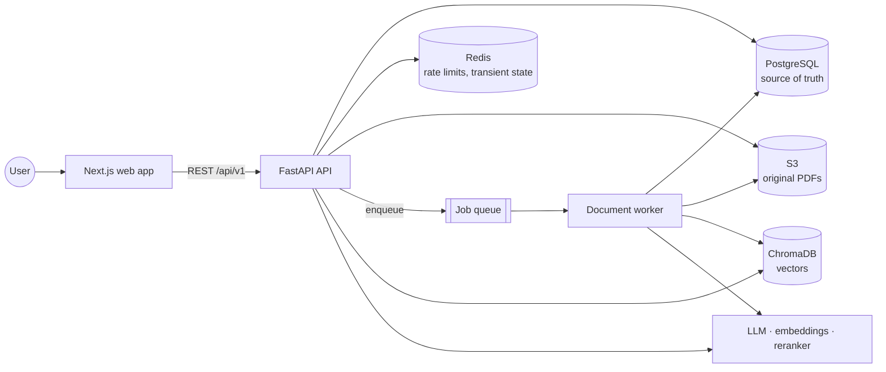
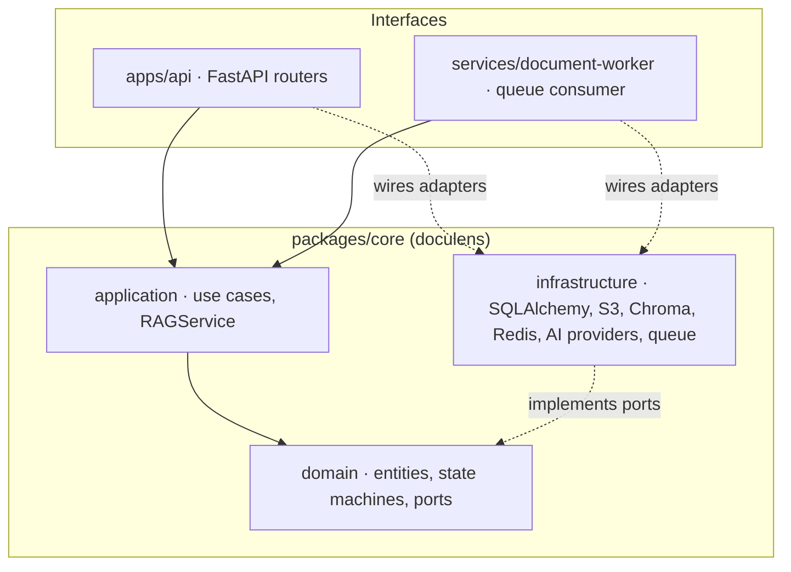

# Architecture

This directory holds the architecture documentation required by SPECIFICATIONS.md §77. Documents
are added as the corresponding subsystems are built; the table at the end lists what is pending.

## System context

## Backend layering

Rules (SPECIFICATIONS.md §72–§74):

- `domain` depends on the standard library only; it declares entities, value objects, state
  machines, domain errors and the ports (`Protocol`s) that outer layers implement.
- `application` depends on `domain` only and orchestrates use cases through ports.
- `infrastructure` implements the ports with concrete technologies. It is the only core layer
  allowed to import SQLAlchemy, boto3, ChromaDB, Redis, LangChain or provider SDKs.
- Interface layers (`apps/api`, `services/document-worker`) translate transport concerns (HTTP,
  queue messages) into application calls and wire concrete adapters via dependency injection.
- Enforcement: packaging (`doculens-core` does not depend on FastAPI) and the AST-based test in
  `packages/core/tests/unit/test_architecture.py`.

## Documents

| Document                      | Spec section | Status                                   |
| ----------------------------- | ------------ | ---------------------------------------- |
| System architecture           | §4, §6       | This page (overview)                     |
| Request flow                  | §33–§36      | Pending: API skeleton phase              |
| Document ingestion            | §10–§16      | Pending: processing phase                |
| RAG pipeline                  | §17–§27      | Pending: RAG phase                       |
| Authentication                | §8–§9        | Pending: authentication phase            |
| Data model                    | §7, §45      | Pending: backend skeleton phase          |
| AWS infrastructure            | §5.4, §57    | Pending: infrastructure phase (OQ-1..3b) |
| CI/CD                         | §59–§60      | `.github/workflows/ci.yml`; CD pending   |
| Observability                 | §50–§52      | Pending: observability phase             |
| Security model                | §53–§58      | Pending: `docs/security.md`              |
| Eventual consistency, cleanup | §31, §69     | Pending: processing phase                |
