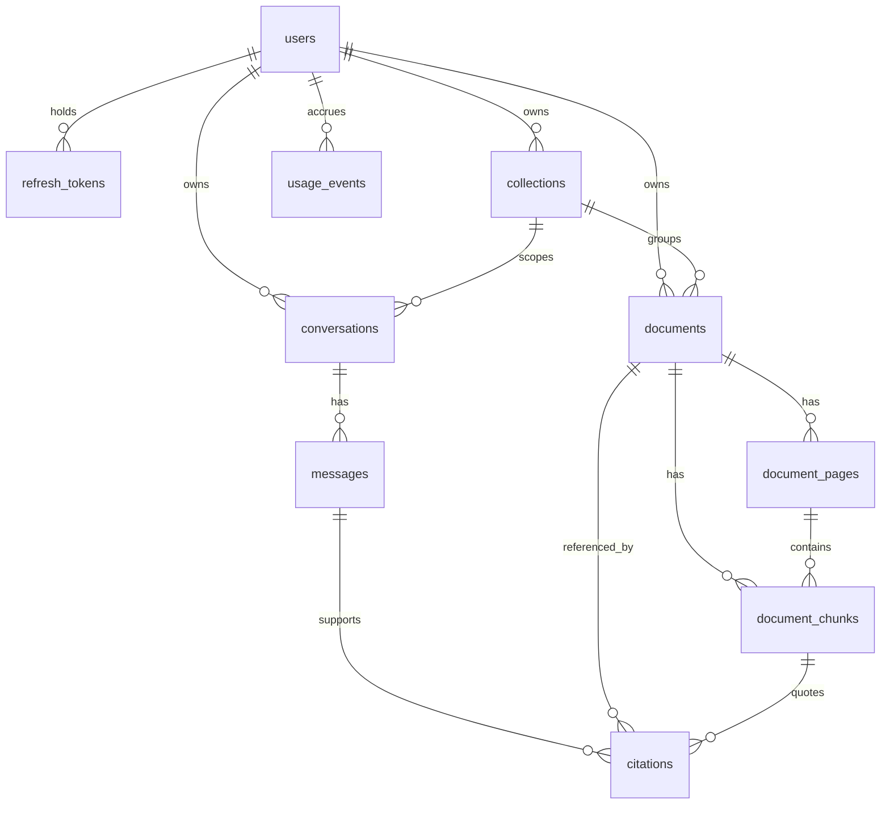

# Database

PostgreSQL is the **source of truth** for DocuLens relational state. Vectors live in ChromaDB;
original PDFs in object storage (S3 / MinIO / filesystem). Redis is never authoritative.

**Models:** `packages/core/src/doculens/infrastructure/persistence/models.py`  
**Migrations:** `packages/core/alembic/versions/` (`0001` … `0005`)  
**Apply:** `make db-upgrade` → `alembic -c packages/core/alembic.ini upgrade head`  
**ADRs:** [ADR-007](decisions/ADR-007-authentication-strategy.md), [ADR-019](decisions/ADR-019-document-lifecycle.md)

## Principles

- Application-generated UUID v4 primary keys; timezone-aware timestamps.
- Foreign keys and delete rules are enforced in PostgreSQL; **no ORM relationships** (no lazy
  loading, no ORM cascades). Repositories filter every user-owned read by `owner_id`.
- Enumerations are constrained `VARCHAR` columns (check constraints), not native PG enums.
- Schema changes go through Alembic only (§45). CI fails if models and migrations diverge.

## Entity-relationship overview



## Tables

| Table             | Role                                                                                                       |
| ----------------- | ---------------------------------------------------------------------------------------------------------- |
| `users`           | Accounts: email (unique, lower-case), Argon2id hash, status                                                |
| `refresh_tokens`  | Refresh JWT `jti` rows; family rotation / revoke ([ADR-007](decisions/ADR-007-authentication-strategy.md)) |
| `collections`     | Owner-scoped folders                                                                                       |
| `documents`       | Metadata, `storage_key`, `processing_status`, content hash, counts                                         |
| `document_pages`  | Per-page extracted text + character count                                                                  |
| `document_chunks` | Chunk text, token count, `vector_id`; GIN FTS on `text`                                                    |
| `conversations`   | Chat threads; optional `collection_id`                                                                     |
| `messages`        | Immutable turns (`USER` / `ASSISTANT` / `SYSTEM`)                                                          |
| `citations`       | Persisted evidence rows for assistant messages                                                             |
| `usage_events`    | Daily question / AI-cost ledger for quotas (idempotency key)                                               |

Jobs are **not** relational rows. Processing work is queue payloads (`ProcessingJob`); progress is
tracked on `documents.processing_status`.

## Key columns and constraints

### `documents`

| Column              | Notes                                                                       |
| ------------------- | --------------------------------------------------------------------------- |
| `processing_status` | See lifecycle below                                                         |
| `storage_key`       | Unique; system path `documents/{user_id}/{document_id}/original.pdf`        |
| `content_hash`      | SHA-256; partial unique `(owner_id, content_hash)` where status ≠ `DELETED` |
| `collection_id`     | Nullable; `ON DELETE SET NULL`                                              |
| `metadata`          | JSONB (PDF / extraction provenance)                                         |

### `document_chunks`

| Column      | Notes                                             |
| ----------- | ------------------------------------------------- |
| `vector_id` | Equals `str(chunk_id)` for deterministic upserts  |
| FTS         | `to_tsvector('simple', text)` + GIN (keyword RAG) |

PostgreSQL is not metadata-only: **keyword retrieval** in hybrid RAG runs full-text search over
chunk text (migration `0004`, repository `search_chunks`). Conceptual shape:

```sql
-- Language-agnostic "simple" config; terms OR-ed; owner + optional document/collection scope.
SELECT c.*, ts_rank_cd(to_tsvector('simple', c.text), query) AS rank
FROM document_chunks c
JOIN documents d ON d.id = c.document_id
WHERE d.owner_id = :owner_id
  AND to_tsvector('simple', c.text) @@ to_tsquery('simple', :oringed_terms)
ORDER BY rank DESC, c.id
LIMIT :limit;
```

Dense hits come from Chroma; both rankings are fused with RRF in application code
([`rag.md`](rag.md)).

### `citations`

| Column         | Notes                                                   |
| -------------- | ------------------------------------------------------- |
| `document_id`  | `ON DELETE RESTRICT` (cited docs cannot hard-disappear) |
| `chunk_id`     | `ON DELETE SET NULL` after reindex / purge              |
| Scores / order | Retrieval and citation ordering metadata                |

### `usage_events`

| Column            | Notes                                    |
| ----------------- | ---------------------------------------- |
| `idempotency_key` | Unique per `(owner_id, idempotency_key)` |
| `usage_day`       | UTC day bucket for daily quotas          |
| `kind`            | Question / cost event discriminator      |

## Lifecycle enumerations

### `ProcessingStatus` (`documents.processing_status`)

`UPLOADED` → `VALIDATING` → `EXTRACTING` → `CHUNKING` → `EMBEDDING` → `INDEXING` → `READY`  
Failures → `FAILED`. Delete saga: `DELETING` → `DELETED`.

Transitions are compare-and-set in application code (`ALLOWED_TRANSITIONS` in
`packages/core/src/doculens/domain/documents.py`).

### Other statuses

| Enum          | Values                           |
| ------------- | -------------------------------- |
| `UserStatus`  | `ACTIVE`, `SUSPENDED`, `DELETED` |
| `MessageRole` | `USER`, `ASSISTANT`, `SYSTEM`    |

## Cross-store consistency

| Operation | Order                                                                    | If interrupted                                                        |
| --------- | ------------------------------------------------------------------------ | --------------------------------------------------------------------- |
| Ingest    | row (`UPLOADED`) → object → pages/chunks → vectors → `READY`             | Non-`READY`; job retry or `FAILED`                                    |
| Re-index  | Upsert vectors by deterministic id → update chunk rows → `indexed_at`    | No duplicate vectors                                                  |
| Delete    | `DELETING` → vectors → object → purge pages/chunks → `DELETED` tombstone | Re-runnable saga ([ADR-019](decisions/ADR-019-document-lifecycle.md)) |

Retrieval serves only `READY` documents for the authenticated owner. Orphan objects/vectors left by
a crash are unreachable through application reads that always start from PostgreSQL.

## Migrations

```bash
make db-upgrade                       # upgrade head
make db-revision m="describe change"  # autogenerate after model edits; review before commit
make db-downgrade                     # one revision back (local only)
```

CD invokes a migrate Lambda (`doculens_api.migrate_handler`) with `alembic upgrade head` only —
**forward-only** in automated deploys ([deployment.md](deployment.md)).

## What this schema does not include

| Item                         | Notes                                        |
| ---------------------------- | -------------------------------------------- |
| Job / outbox tables          | ADR-011 uses straggler reconcile, not outbox |
| Admin / org / RBAC tables    | Single-owner personal tenancy                |
| Email verification tokens    | **OQ-24**                                    |
| Soft-deleted user purge jobs | Status reserved; no account-delete API       |
