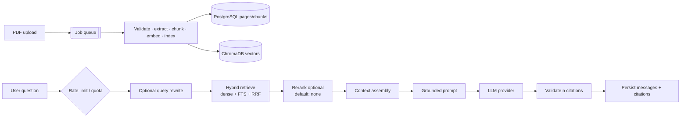

# RAG pipeline

How DocuLens turns PDFs into grounded, citable answers. This document describes **what the code
does today**. It does not claim production LLM quality from the offline eval suite.

**Composition:** `packages/core/src/doculens/application/rag.py` (`RagService`)  
**Wiring:** `packages/core/src/doculens/infrastructure/rag.py`  
**HTTP:** `apps/api` conversation routers (sync + SSE)  
**ADRs:** [015](decisions/ADR-015-ingestion-pipeline.md) · [016](decisions/ADR-016-retrieval-service.md) ·
[017](decisions/ADR-017-grounded-prompt.md) · [018](decisions/ADR-018-answering-pipeline.md)  
**Eval honesty:** [`eval/methodology.md`](eval/methodology.md)

## End-to-end flow

## Stage 1 — Ingestion (async worker)

Runs outside the API request ([ADR-006](decisions/ADR-006-async-processing.md),
[ADR-015](decisions/ADR-015-ingestion-pipeline.md)).

| Stage        | What happens                                                                 | Key knobs                                           |
| ------------ | ---------------------------------------------------------------------------- | --------------------------------------------------- |
| Intake (API) | Extension, MIME, size, `%PDF-` signature, quotas, store original, `UPLOADED` | `MAX_FILE_SIZE_MB`, `QUOTA_*`                       |
| VALIDATING   | Hash, open PDF, encryption/corruption, page count                            | `MAX_PAGES_PER_DOCUMENT`                            |
| EXTRACTING   | PyMuPDF in isolated child process (time + memory bounded)                    | `PDF_EXTRACTION_*`                                  |
| CHUNKING     | Page-scoped, paragraph/sentence packing with overlap                         | `CHUNK_SIZE`, `CHUNK_OVERLAP`, `MIN_CHUNK_SIZE`     |
| EMBEDDING    | Batched provider calls with usage accounting                                 | `EMBEDDING_*`                                       |
| INDEXING     | Owner-scoped upsert; `vector_id == str(chunk_id)`                            | `VECTOR_STORE`, `CHROMA_*`, `INDEXING_BATCH_CHUNKS` |

**Not implemented:** OCR for scanned PDFs. Extraction is text-layer PyMuPDF only.

Worker outcomes: success → ACK; validation/`FAILED`/`skipped` → ACK (no DLQ burn); retryable
errors → abandon visibility / partial batch failure; attempt budget exhausted →
`fail_permanently` + ACK. Each Lambda batch also reconciles orphaned `UPLOADED` rows
([ADR-011](decisions/ADR-011-job-enqueue-consistency.md)).

## Stage 2 — Retrieval

Default strategy: **`hybrid`** ([ADR-016](decisions/ADR-016-retrieval-service.md)).

1. **Preprocess** — normalise and bound query length (`RETRIEVAL_MAX_QUERY_CHARACTERS`).
2. **Scope** — resolve to the caller's `READY` document ids (selected docs, collection, or all).
   Foreign ids → not found.
3. **Dense** — embed query → Chroma search with owner + document-id filters.
4. **Keyword** — PostgreSQL FTS (`simple` config, GIN) over chunk text.
5. **Fusion** — reciprocal rank fusion (`RRF_K = 60`).
6. **Select** — load chunk **text from PostgreSQL** (never the vector copy); drop stale/dup/OOS.
7. **Rerank** — `RerankingStage` fail-open. Production-shaped config uses `RERANKER_PROVIDER=none`.
   Only `none` / `fake` adapters exist; there is **no hosted production reranker**.
8. **Assemble** — `CONTEXT_MAX_CHUNKS`, `CONTEXT_MAX_CHARACTERS`, per-document diversity.

| Setting                  | Default  |
| ------------------------ | -------- |
| `RETRIEVAL_STRATEGY`     | `hybrid` |
| `RETRIEVAL_CANDIDATES`   | 20       |
| `RETRIEVAL_MIN_SCORE`    | 0.0      |
| `RERANK_TOP_K`           | 5        |
| `CONTEXT_MAX_CHUNKS`     | 5        |
| `CONTEXT_MAX_CHARACTERS` | 12000    |

## Stage 3 — Answering and citations

([ADR-017](decisions/ADR-017-grounded-prompt.md), [ADR-018](decisions/ADR-018-answering-pipeline.md))

1. Optional **follow-up rewrite** (fail-open) when conversation history exists.
2. Retrieve + assemble as above.
3. **Empty context** → fixed insufficient-evidence sentence; **no LLM call**.
4. Build prompt: fixed system policy; history as bounded prior messages; final user message with
   numbered evidence blocks then the question. Document text is delimited **data**, not instructions.
5. Generate via `LLMProvider` (`openai` or `fake`).
6. Server-side validation of `[n]` references; invalid indexes dropped; citations quote evidence
   (truncated). Policy violations can withhold the answer.
7. Persist user + assistant messages and citation rows in one transaction. On generation failure,
   **nothing** is persisted (retryable error). SSE streams tokens progressively and persists only
   on a successful final event.

## Providers

| Port                | Adapters                  | Deployed constraint                       |
| ------------------- | ------------------------- | ----------------------------------------- |
| `EmbeddingProvider` | `fake`, OpenAI-compatible | Fake refused when deployed                |
| `LLMProvider`       | `fake`, OpenAI-compatible | Fake refused when deployed                |
| `RerankerProvider`  | `none`, `fake`            | `fake` refused when deployed → use `none` |
| `VectorStore`       | Chroma, in-memory (tests) | Hosting of Chroma in AWS is **OQ-1**      |

Production vendor choice (Bedrock vs hosted OpenAI-compatible, etc.) remains configuration /
operator choice (**OQ-17**); the ports are stable.

### Provider contract (production judgment)

| Concern              | Behaviour in code                                                                 |
| -------------------- | --------------------------------------------------------------------------------- |
| Timeouts             | Separate knobs for embed / generate / rewrite / retrieval / rerank                |
| Retries              | Bounded exponential backoff on transient provider errors                          |
| Content filters      | Structured provider errors; unsafe completions can be withheld                    |
| Deployed fail-closed | Fake AI, missing keys, oversized ask timeouts vs API Gateway are rejected at boot |
| Usage                | Token counts recorded; optional `AI_PRICING_JSON` for daily cost quotas           |
| Testability          | `fake` providers keep CI deterministic; offline eval uses oracle/induced answers  |

## Evaluation

Offline deterministic suite under `evals/` (hybrid + bag-of-words embeddings; oracle-scripted
answers for most cases). See [`eval/methodology.md`](eval/methodology.md) and
[`evals/README.md`](../evals/README.md). A green CI run proves pipeline contracts — **not**
frontier-model answer quality.

## Explicit non-goals (current code)

| Item                              | Status               |
| --------------------------------- | -------------------- |
| OCR / scanned-PDF text            | Not implemented      |
| Semantic search HTTP API          | **OQ-10** open       |
| Hosted cross-encoder reranker     | Not implemented      |
| Online / real-provider eval in CI | Optional (**OQ-22**) |
| Multi-hop agentic RAG             | Not in scope         |
